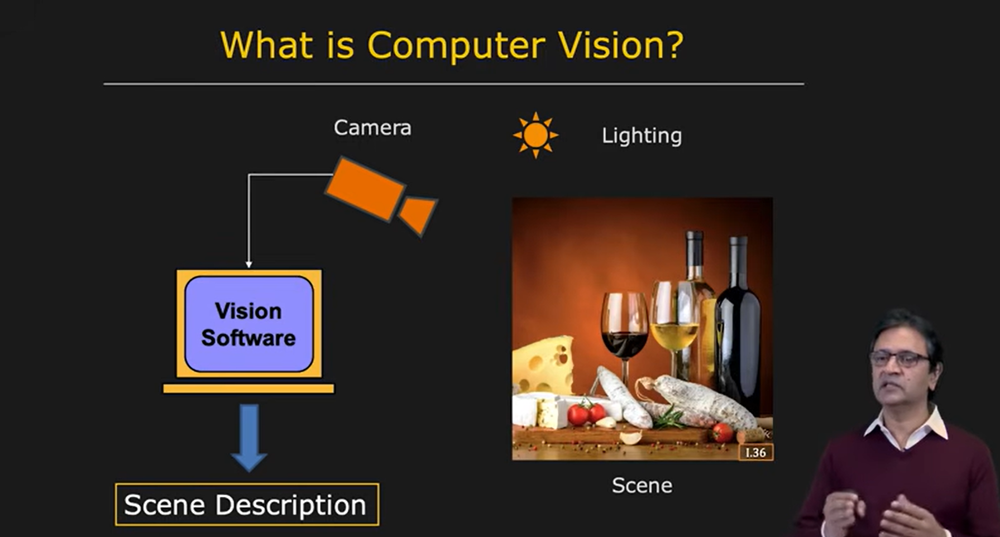
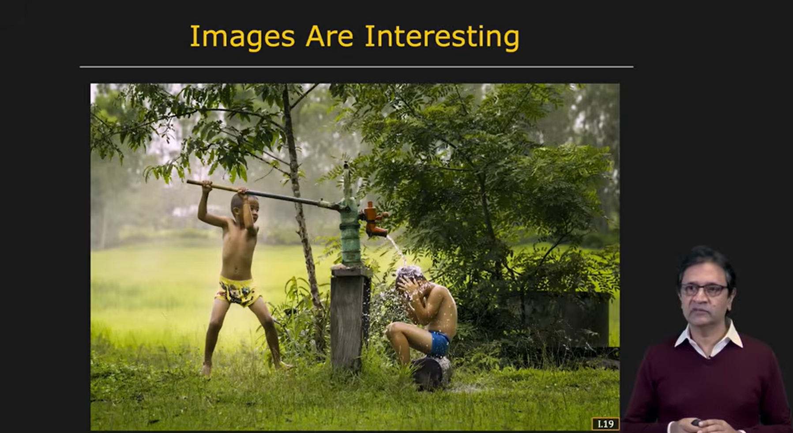
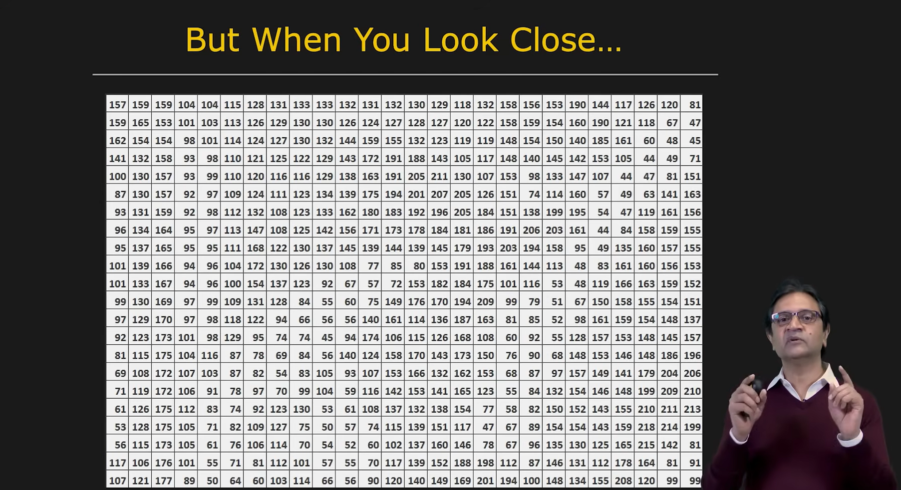

# What is computer vision? :

Here are the basic elements of a computer vision system.

On the right here, you see a three dimensional scene. This scene is lit by some form of lighting. It could be very simple outdoor lighting as in the case of a single point light source, the sun, or it could be more complex indoor lighting with various types of lamps.

Irrespective, without lighting, there is no vision. And the light from these various light sources falls in the scene and is scattered or reflected by the scene in many different directions. And a small fraction of this light is scattered in the direction of this camera shown here, which plays the role of the human eye.

The camera takes light from the three dimensional scene to produce a two dimensional image. This image is passed on to your vision software. And the goal of this vision software is to come up with a symbolic description of the scene.

For example, it might be able to say that there are two wine bottles, wine glasses. There's bread, cheese on the table. And a more sophisticated vision system may be able to tell you how fresh the bread is, exactly what types of cheese are on the table, and perhaps even the vintage of the wine.

---

### So what would be a concise definition for computer vision?

### But what computer vision really is?:

Well, it really depends on the background of the person that you ask.

* For instance, David Maher, who wrote one of the first textbooks on vision, said that vision is automating human visual processes. He was really looking at computer vision as the emulation of human vision.
* Others have said that vision is an information processing task.
* Berthold Horn, who wrote the book Robot Vision, said that vision is inverting image formation.

Let's think about this for a second. An image is the projection of a three dimensional world onto a two dimensional plane. And so now, one can think about computer vision as taking this two dimensional image and somehow walking back into the three dimensional world to say things about the objects that compose that world.

So another way to say this is perhaps vision is the inverse of graphics. In computer graphics, as you know, you create very elaborate three dimensional models of objects. You place them in a scene. You illuminate the scene with some type of lighting. And you seek to obtain a photorealistic image of the scene. In our case here, in vision, we're going to start with an image that's given to us and try and walk back into the three dimensional world and say things about the objects that make up that world.

My PhD advisor, Takeo Kanade, used to say that irrespective of the definition, vision is fun. And that's true. But perhaps more importantly, vision is really useful.

---

### Vision Deals with images:

An image is an array of pixels. Pixel, by the way, is short for picture element. And each pixel in your image records information about a corresponding point in the scene. If you look at consumer cameras, a pixel provides the brightness and color of the corresponding point in the scene.

More recently, we have seen more sophisticated cameras that can measure at each pixel the depth or the distance of the point in the scene. And in the years to come, we will see, I believe, cameras that can also detect the material properties of points in the scene. We will be able to tell whether a point is made of glass or wood or plastic or metal.

So with the passage of time, cameras are going to get more sophisticated. They're going to be able to extract information that goes well beyond what the human eye can. And therefore, computer vision systems will be able to perceive things about the scene that you and I simply cannot see.

Now, needless to say, images are interesting.

---

### Image are intesring:

You simply open your eyes and take a look at this image here.

And you'll see there are two boys. One of them is taking a bath. You get a sense for the three dimensional structure of the scene, the vegetation, perhaps the time of day, and maybe even the weather because you see a bit of fog in the background. And in fact, you can even get a sense for the playful mood of the scene. Maybe the sensation of what the boy may be feeling as the water strikes his head. All of this in a fraction of a second by simply opening your eyes and taking a look at the image.

But for you to understand how challenging computer vision is, I want you to look at not this image, but its digital equivalent, which is this.

It's nothing but an array of numbers. And it is from this set of numbers that we seek to extract all the information that you and I perceived in the previous slide. This should give you a sense for why vision is really challenging, and why vision is fun.

---

### So where do we stand?

### Vision research:

Well, there's been about 50 years of research

Vision Research in computer vision.

And we've learned a few things.

* First, the obvious-- vision is hard.
* Second, it's a highly multidisciplinary field. It's not an isolated field. It draws on optics for imaging, signal processing as in electrical engineering, algorithms in computer science, and even neuroscience and psychology and sometimes even biology.

But we can say today that a considerable amount of progress has been made. And we've begun to see some very successful applications of vision. But I should mention that we have just scratched the surface. In the coming decades, we can expect computer vision to have a profound impact on the way that we live our lives.