# Applications of Computer Vision

Computer vision is used in many industries and applications. The following examples represent only a portion of the field's uses.

---

## Factory Automation

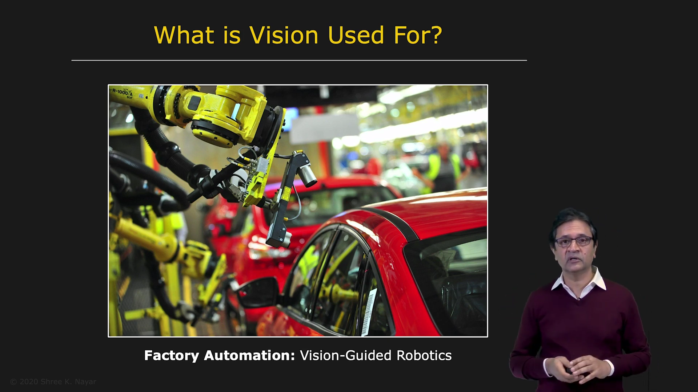

Manufacturing is highly automated. For example, automobiles are assembled almost entirely by robots.

These robots use computer vision to handle uncertainties in the physical world. If one part must be mounted onto another, vision can determine the precise position of both parts. This makes vision-guided robotics an important application of computer vision.

### Visual Inspection

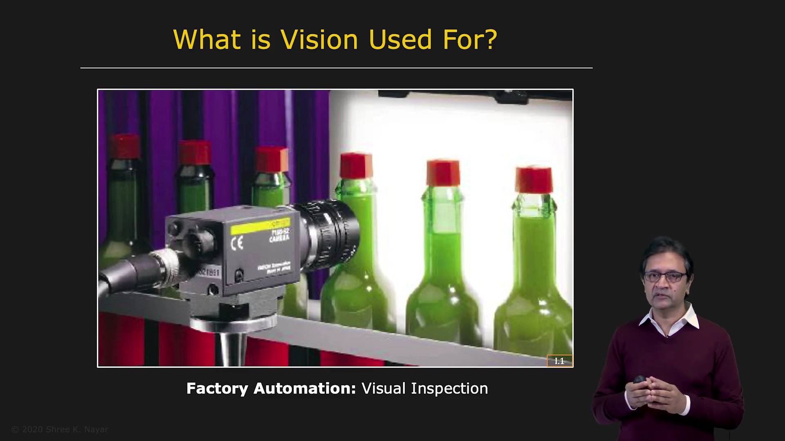

Manufacturing processes operate at extremely high speeds, making manual inspection impractical. At the same time, the components used in modern products are becoming smaller than the human eye can easily inspect.

Computer vision systems can inspect products rapidly and accurately, making them vital to factory automation.

### Optical Character Recognition

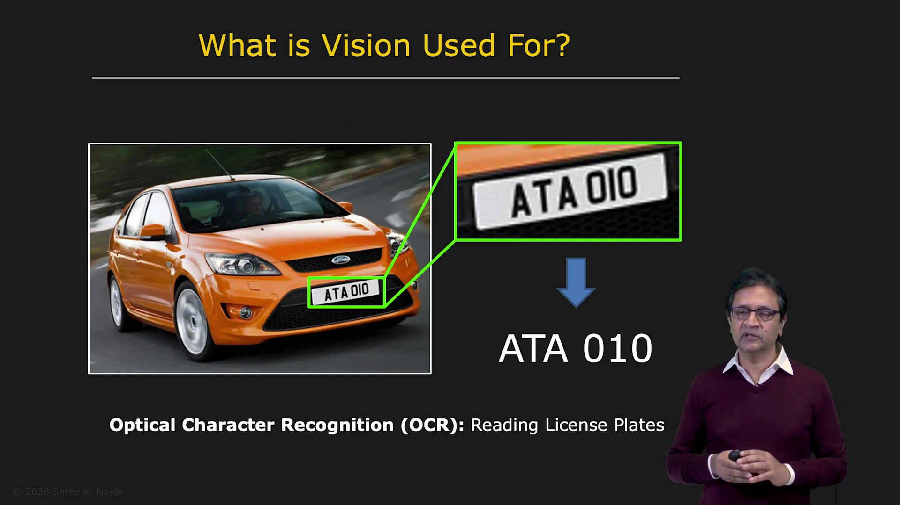

Optical Character Recognition, or OCR, allows computers to read text from images.

For example, a traffic system can identify a vehicle traveling too fast, read its license plate, and send a ticket to the registered owner.

OCR is also used for:

* Digitizing physical books
* Authenticating signatures on checks
* Reading addresses on envelopes and packages
* Processing mail in postal services

---

## Biometrics

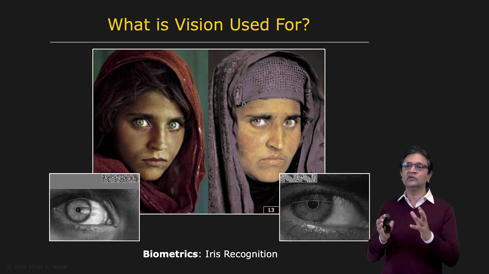

Biometrics uses physical characteristics to determine a person's identity.

For example, the iris of the eye contains a pattern that is almost as unique as a person's DNA. Iris recognition can therefore be used for access control and other identification applications.

### Face Detection and Recognition

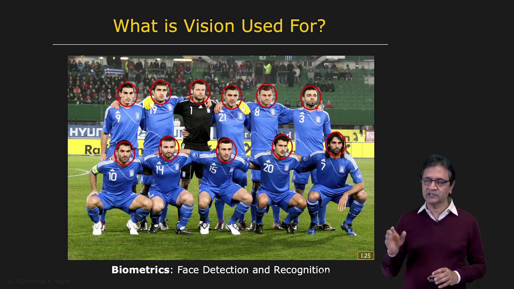

Face detection and recognition are among the most popular applications of computer vision.

Modern systems can detect faces reliably in many types of images. This is useful for:

* Organizing personal photo collections
* Security and surveillance
* Recognizing a person's identity

A detected face can be analyzed further to determine who the person is.

---

## Intelligent Marketing

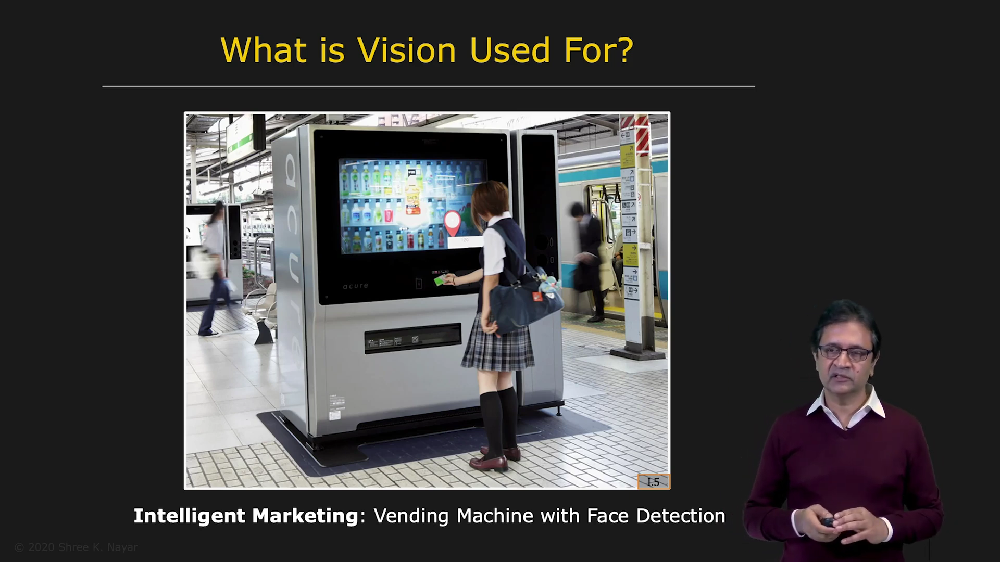

Some vending machines use computer vision to detect a customer's approximate age and gender. Based on this information, the machine can display products that may be of interest to that person.

This is an example of intelligent marketing using vision.

---

## Security

### Object Detection and Tracking

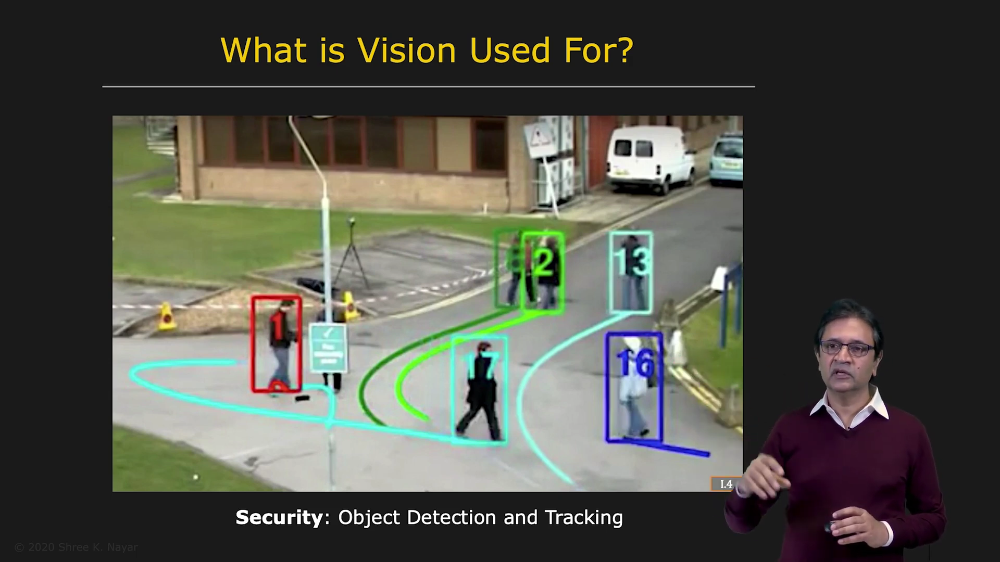

Computer vision can track objects as they move through complex environments.

For example, a system may track people walking through a crowded area, even when they are temporarily blocked by other people or objects. Modern tracking systems can also hand a person over from one camera to another as they leave one camera's field of view.

This technology is useful in security, surveillance, and crowd analysis.

---

## Human–Computer Interaction

### Optical Mouse

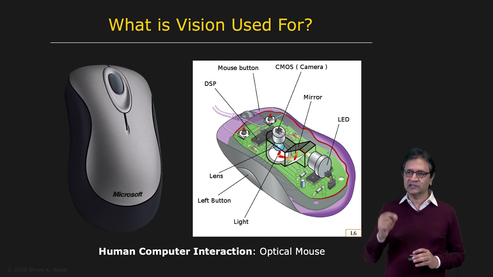

An optical mouse contains a small computer vision system.

It includes:

* A tiny camera that captures low-resolution images at a high frame rate
* A lighting system that illuminates the surface below the mouse
* Software that analyzes surface patterns

By comparing these patterns, the system determines how the mouse moves relative to the surface. This information is then used to control the cursor on a computer screen.

---

## Entertainment and Gaming

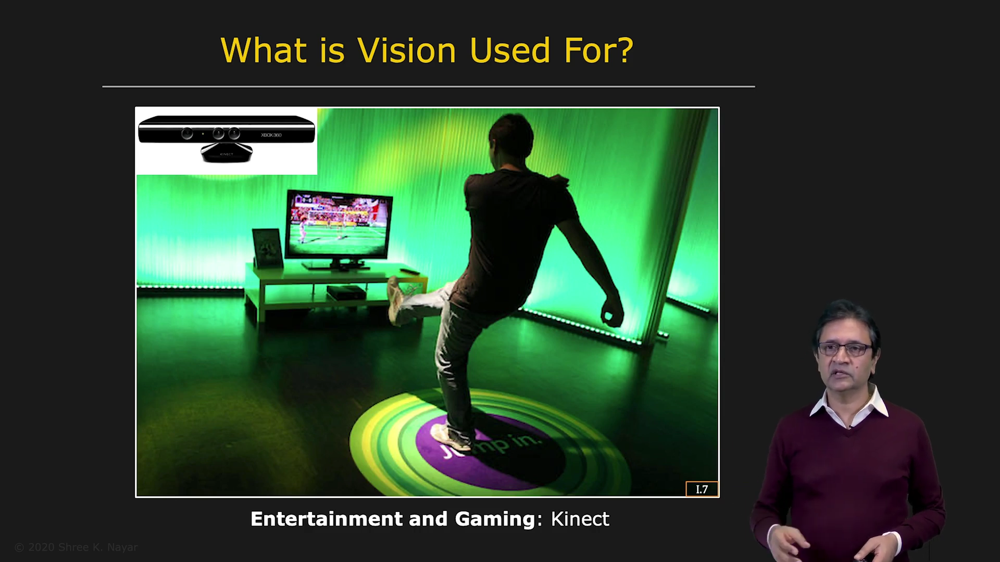

Modern gaming systems, such as Kinect and PlayStation devices, use vision sensors to capture the motion of the human body.

This technology has enabled a new generation of interactive and engaging games.

### Visual Effects and Motion Capture

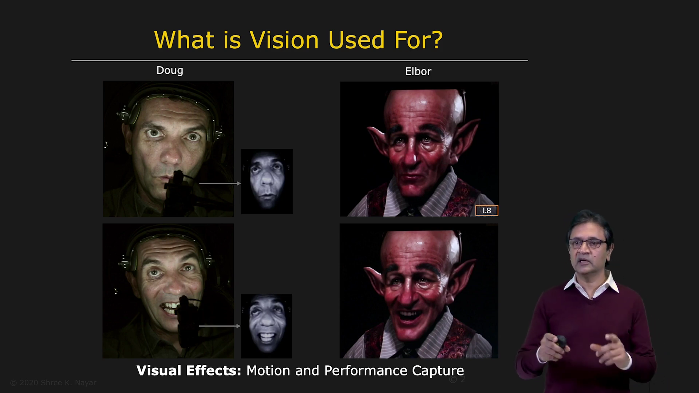

Computer vision is also used to create special effects for movies and animations.

For example, an actor may wear headgear containing a camera. The camera observes the actor's face and captures facial expressions in real time. A vision system then extracts the expression in three dimensions and maps it onto a virtual character.

This allows an actor's expressions to control an animated or digital character.

---

## Augmented Reality

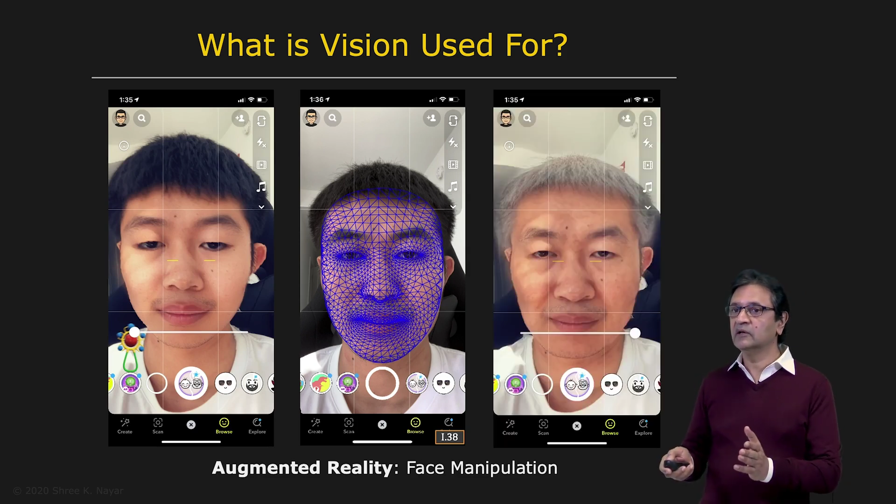

Augmented reality systems can analyze a person's face and construct a three-dimensional face model.

For example, applications such as Snapchat use a facial mesh extracted in real time. This model can be used to manipulate the face, such as making a person appear younger or older.

---

## Visual Search

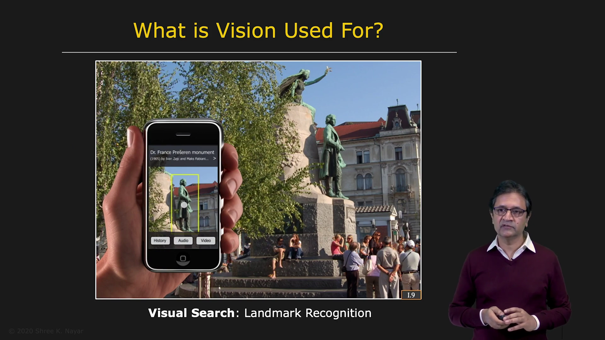

Visual search allows users to obtain information by taking a picture.

For example, a person can photograph a monument and immediately receive historical information about it. Visual search can be performed through the internet or using personal devices.

---

## Exploration

### Autonomous Navigation and Space Exploration

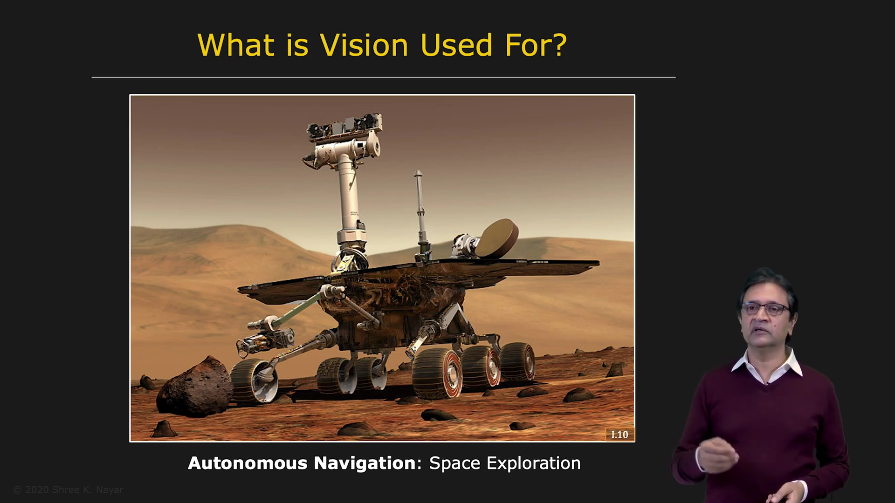

Computer vision is essential for exploring places where humans cannot easily travel.

The Mars Rover uses several vision sensors, including cameras, to analyze the Martian environment. Since humans have not yet explored most of the planet's surface, the rover must use computer vision to gather information and send it back to Earth.

The system can help determine:

* The terrain and surface geometry
* The material properties of the environment
* Safe paths for navigation

Similar technology is useful in disaster zones, nuclear facilities, and other dangerous environments where sending humans would be unsafe.

---

## Autonomous Navigation

### Driverless Cars

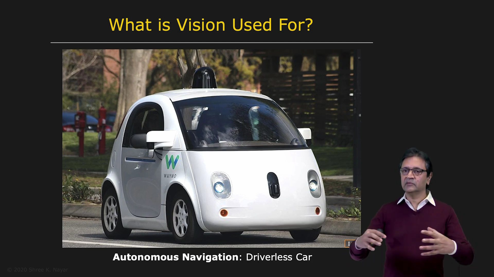

Driverless cars use many types of vision sensors, including:

* Visible-light cameras
* Depth cameras
* Infrared cameras

Together, these sensors extract detailed information about the geometry of the surrounding environment in real time.

The vehicle uses this information to make decisions in different traffic situations. Autonomous vehicles are expected to become an important part of everyday life.

---

## Remote Sensing

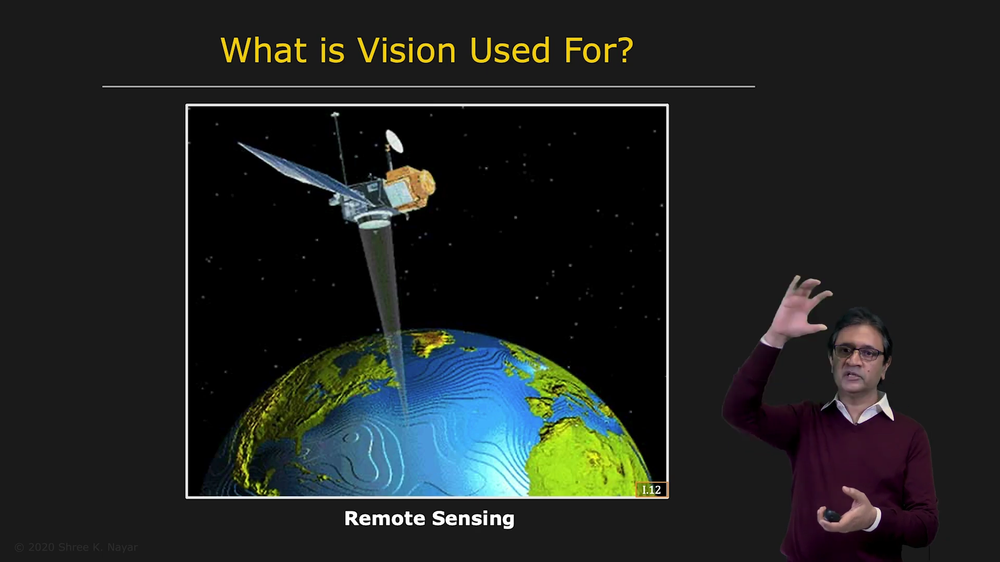

Satellites contain high-quality image sensors and computer vision systems. As a satellite orbits Earth, it can collect information used to reconstruct three-dimensional maps of the planet's surface.

This information can be used for:

* Digital maps such as Google Maps
* Monitoring disaster zones
* Studying the long-term effects of climate change

---

## Medical Image Analysis

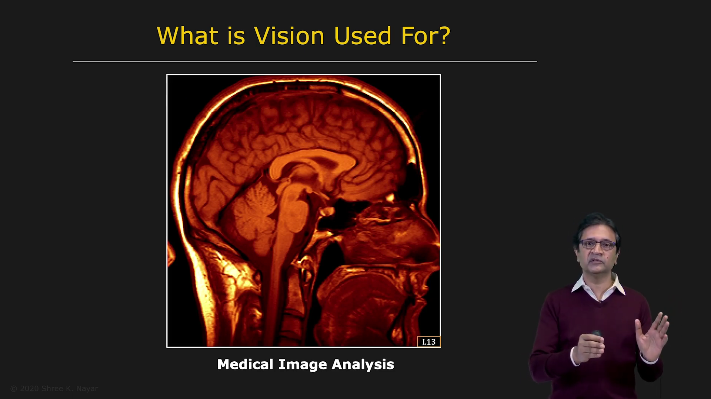

Medical imaging is another major application of computer vision.

Unlike consumer cameras, which usually capture brightness and color in the visible-light spectrum, medical imaging systems use different modalities, including:

* X-ray imaging
* Ultrasound imaging
* Magnetic resonance imaging

Computer vision models and methods can be applied to these images to recover anatomical structures and provide an initial diagnosis to assist physicians.

---

## Conclusion

Computer vision has enormous practical value. It is used in manufacturing, security, entertainment, transportation, space exploration, remote sensing, and medicine.

These examples represent only a small portion of its applications. As computer vision continues to develop, it is likely to have a profound impact on the way we live and work.