# The Human Eye and Visual Cortex

Before developing tools to solve computer vision problems, it is useful to understand how the human visual system works.

---

## Human Eye and Visual Cortex

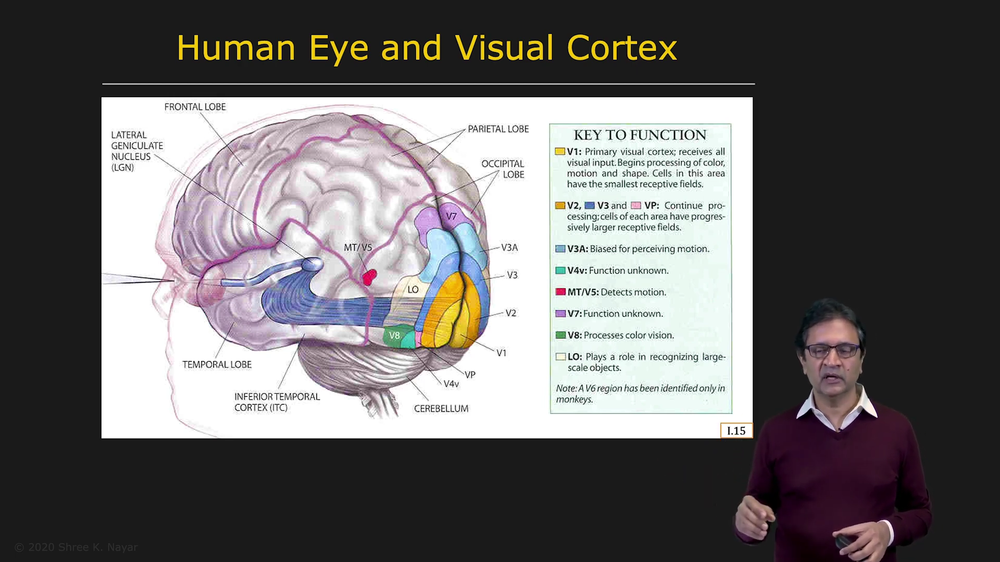

The human eye contains a lens that projects the three-dimensional world onto a two-dimensional image. This image is formed on the retina at the back of the eye.

The retina contains cells that perform some early visual processing. Therefore, a certain amount of information reduction takes place within the retina itself.

The processed information then travels through the optic nerve to the lateral geniculate nucleus. This structure acts as a relay and determines which information should be sent to different parts of the brain.

The information is finally transmitted to the visual cortex. Different parts of the visual cortex are responsible for analyzing properties such as:

* Shape
* Color
* Motion
* Texture

Although scientists know a great deal about the human visual system, many details remain unknown. For example, we know approximately where motion analysis takes place, but we do not know the exact circuit structure of that region.

We do not yet know how the neurons are connected or what their connection weights are. As a result, we do not have a detailed architecture that can be mapped directly onto computer hardware to reproduce the human visual system.

Human vision is easy for us to use, but we are still far from completely understanding how it works.

---

## Why Do We Reinvent Vision?

The human visual system is remarkably versatile and can handle many complex real-world situations. However, it is mainly qualitative rather than quantitative.

For example, humans can estimate the length of a pencil, but they cannot reliably determine its length in millimeters without using a measuring tool. Such estimates are not precise enough for applications such as factory automation or medical imaging.

Although no computer vision system is as versatile as human vision, many computer vision systems already provide greater precision and reliability for specific tasks.

For some applications, the human visual system may therefore be the wrong system to imitate.

Human vision is also more fallible than we usually realize. When we perceive something incorrectly, we generally do not have an internal warning that tells us our perception is wrong.

Optical illusions demonstrate this limitation.

---

## Optical Illusions

### Fraser's Spiral

|  | |
| :---: | :---: |
| 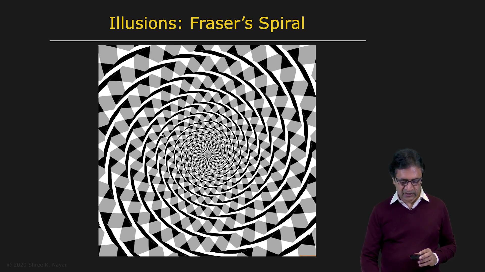 | 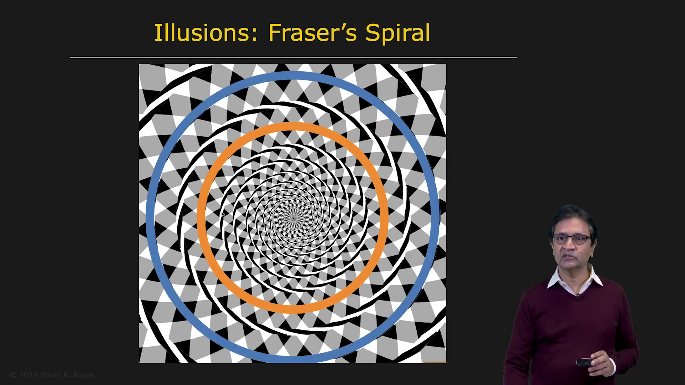 |

When looking at Fraser's spiral, we appear to see a spiral emerging from the center.

However, there is no actual spiral in the image. If one of the contours is followed all the way around, it eventually returns to its starting point. The image is actually made up of several concentric circles.

The visual system interprets the pattern as a spiral even though the image contains only circular contours.

---

### Checker Shadow Illusion

| | |
| :---: | :---: |
| 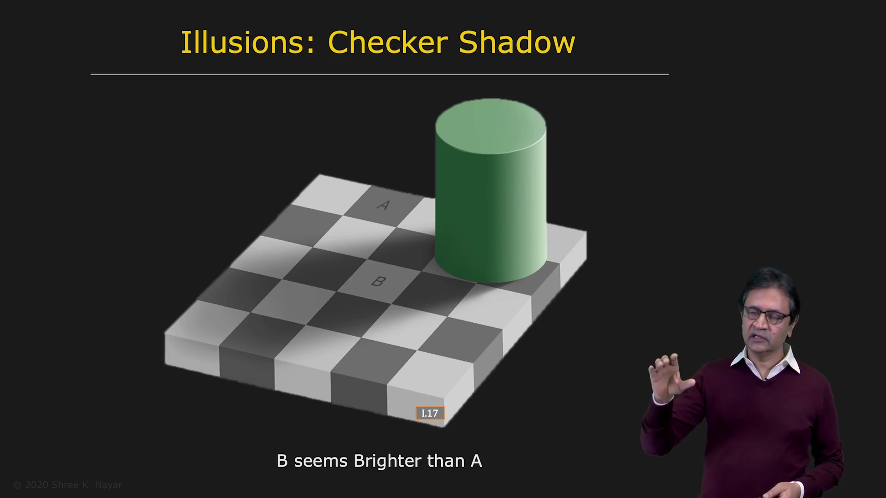 | 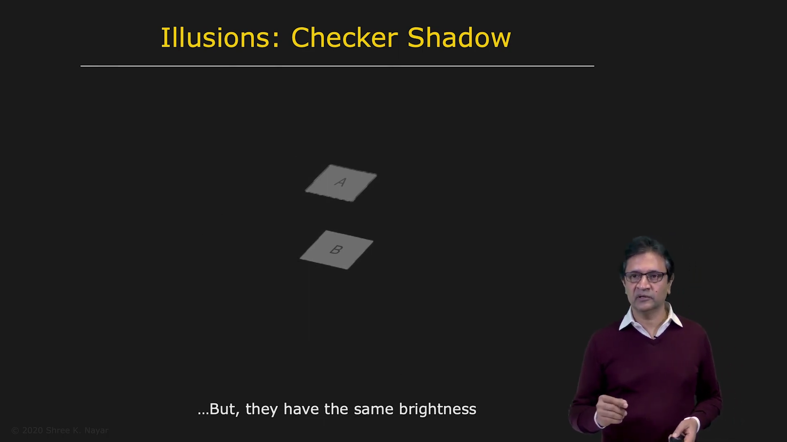 |

The Checker Shadow Illusion shows a checkerboard placed on the floor with a cylinder casting a shadow over it.

Two patches, usually labeled A and B, appear to have different brightness levels. Patch A seems darker than patch B.

However, when the surrounding scene is hidden, both patches are revealed to have exactly the same brightness.

The visual system recognizes that the illumination varies across the scene. It compensates for this variation and estimates the material properties of the patches. As a result, the visual system perceives patch A as being made of darker material than patch B.

---

### Donguri Wave

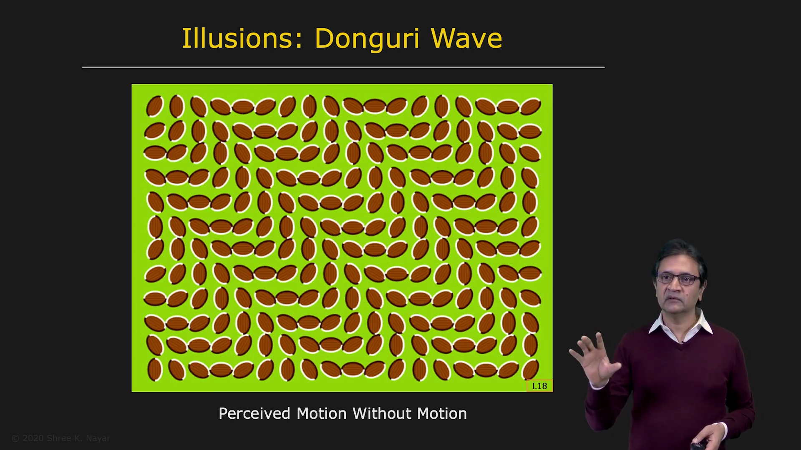

The Donguri wave illusion creates the perception that red leaves are moving or waving.

However, the image is a static photograph. No part of the image is actually moving.

This demonstrates that the visual system can perceive motion even when the visual input contains no real motion.

---

### Forced Perspective

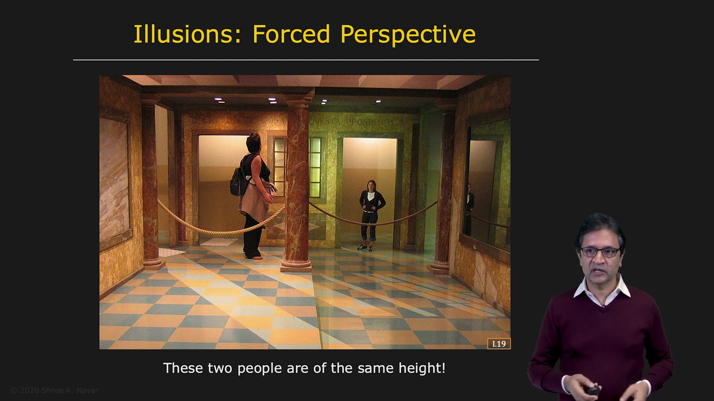

In a forced-perspective image, two people may appear to have very different body sizes.

Although one person appears much shorter or smaller than the other, both people may actually be the same height.

This effect occurs because the room is not a regular cuboid. The distance between the floor and ceiling changes as the room extends away from the camera. The structure of the room creates an illusion of different relative sizes.

---

## Visual Ambiguities

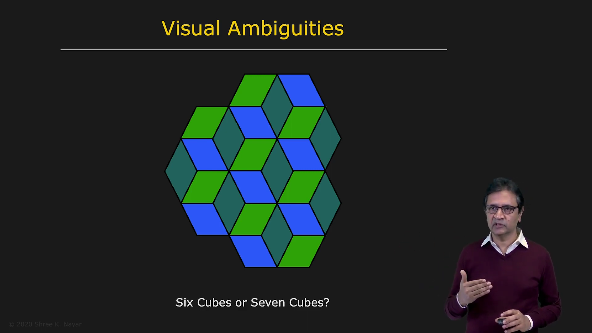

An illusion occurs when the visual system incorrectly interprets an image. An ambiguity occurs when an image supports more than one valid interpretation.

A three-dimensional world is projected onto a two-dimensional image. During this process, one dimension is lost, creating fundamental ambiguities.

### Ambiguous Cubes

When looking at an arrangement of cubes, a particular vertex may appear to point outward or inward. Depending on the interpretation, the image may appear to contain six cubes or seven cubes.

Both interpretations are possible. While observing the image, the perceived interpretation may even switch between the two.

---

### Young Woman or Old Woman

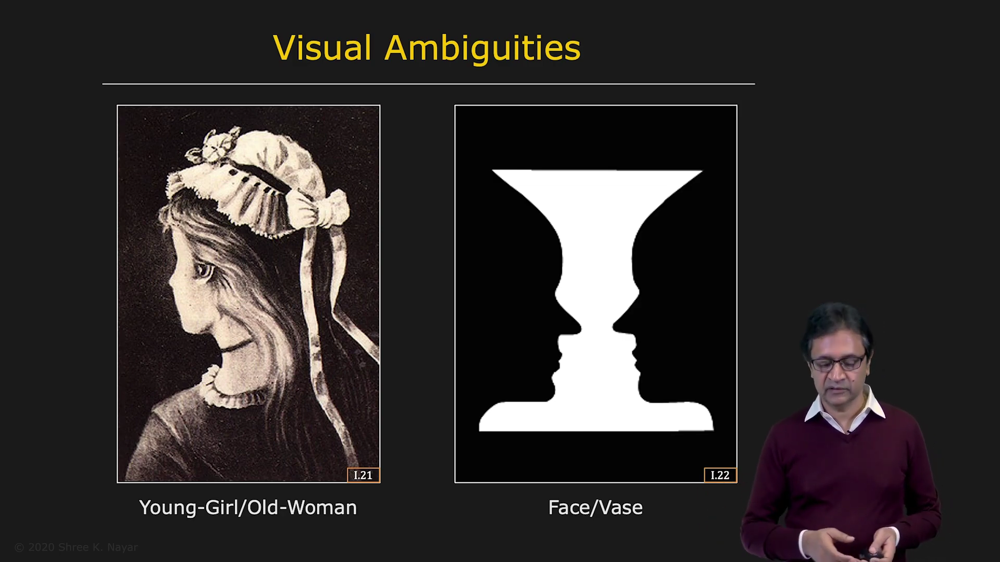

An ambiguous image may appear to show either:

* A young woman facing away, with a necklace and a small nose
* An old woman in profile, with a large nose and mouth

The image itself does not change. Only the interpretation changes.

---

### Vase or Two Faces

This image can be interpreted in two different ways:

* A vase in the center
* Two faces looking toward each other

The visual system switches between the two interpretations because both are consistent with the image.

---

### Mound or Crater

| | |
| :---: | :---: |
| 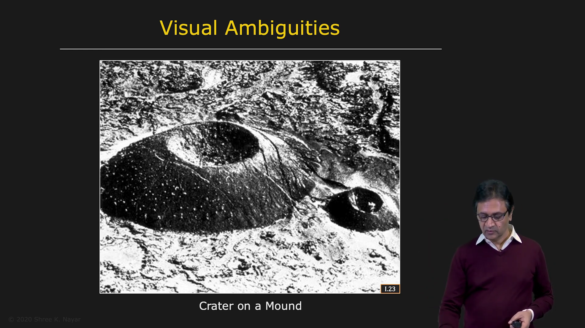 | 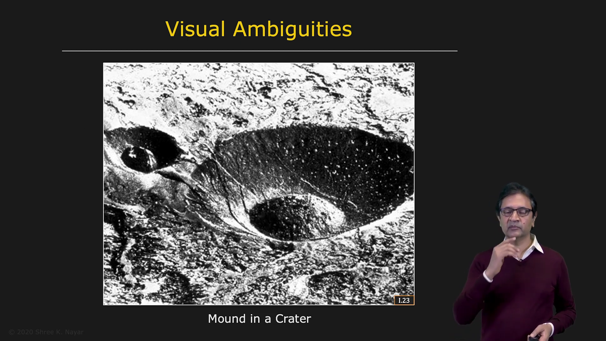 |

An image may initially appear to show a large mound with a small crater in the center.

When the image is turned upside down, it may instead appear to show a large crater with a small mound in the center.

This occurs because illumination in the natural world generally comes from above, such as from the sun or ceiling lights. The visual system uses this assumption to interpret shading.

Since shading alone does not uniquely determine the shape of an object, the assumption about the lighting direction can produce different interpretations.

---

## Seeing Versus Thinking

### Kanizsa Triangle

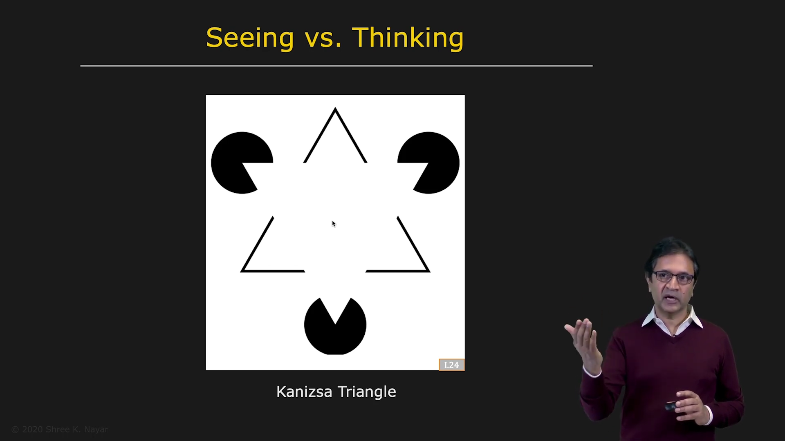

The Kanizsa Triangle appears to contain a white triangle in the center of the image.

The triangle seems brighter than the surrounding background and may even appear closer to the viewer. However, no actual triangle is present.

The image contains only three fragmented, Pac-Man-like discs arranged in a particular configuration. The brain fills in the missing information and creates the perception of a triangle.

This demonstrates the difference between seeing and thinking. The visual system does not merely record the image; it actively interprets the available information.

---

## Conclusion

The human visual system is highly capable, but it is not perfectly accurate. It makes assumptions about illumination, depth, shape, motion, and object size.

Optical illusions and visual ambiguities show that perception is an active process rather than a direct representation of the physical world.

Understanding the strengths and limitations of human vision helps us design computer vision systems. Computer vision does not always need to imitate human vision. In many applications, it must provide greater precision, reliability, and quantitative accuracy.