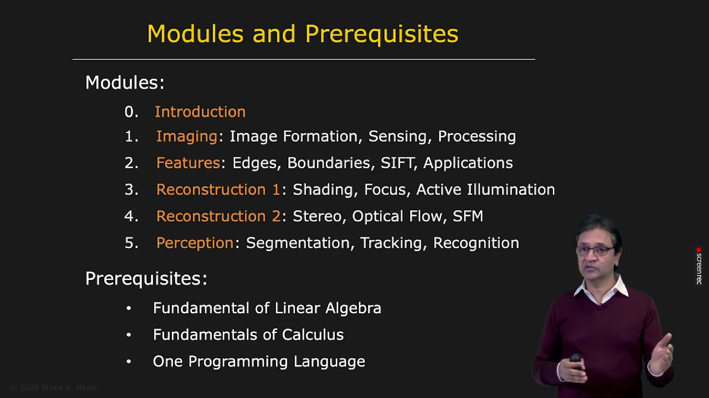

# Course Overview: Topics Covered in Computer Vision

Now let us look at the major topics covered in this course.

---

## Image Formation and Optics

### Where Do Images Come From?

We begin with image formation and optics.

The key question is: how does a three-dimensional world get mapped onto a two-dimensional image? We study the relationship between a point in 3D space and its projection in the image plane. We also analyze how the brightness of a scene point is related to the brightness of its projected image.

---

## Converting Optical Images to Electrical Signals

Once an optical image is formed, we need a way to record it as a digital image. This is done using image sensors.

Over the past two decades, image sensor technology has advanced dramatically. This progress is one of the main reasons behind the current digital imaging revolution.

We will study different types of image sensors and how they convert light into electrical signals and then into digital images.

---

## Binary Images

The simplest kind of image we can work with is a binary image. A binary image has only two values, typically black and white.

For example, a structured scene such as a factory line can be illuminated in a controlled way, allowing the object to be isolated by thresholding. The result is a clean silhouette or binary mask that is easy to store and process.

Binary images are useful because they allow simple and robust object measurements. Many effective vision systems are built on this idea.

---

## Image Processing

Next, we study image processing.

For general grayscale or color images, we often need to transform the image into a form that is easier for later visual analysis. This may involve reducing noise, enhancing contrast, preserving important edges, or improving visual structure.

We will cover a wide range of image-processing tools that provide the foundation for more advanced computer vision techniques.

---

## Feature Detection

### Edge and Corner Detection

After image processing, we move to feature detection.

The first features we study are edges and corners. These are important because they often correspond to object boundaries and visually meaningful structures in an image.

We will develop the theory behind edge detection and then use it to construct practical edge and corner detectors.

---

### Finding Continuous Lines from Edge Segments

Once an edge detector is applied, the image is converted into an edge map: a set of image locations where intensity changes are strong.

Humans can easily group these edges into continuous contours or object boundaries, but machines must do this algorithmically. We therefore study how to connect edge fragments and reconstruct boundaries from the raw edge data.

---

### 2D Recognition Using Features

We then turn to powerful local image features known as SIFT features.

These features are found at distinctive points, often in textured or blob-like regions of the image. They are robust to translation, rotation, scaling, and partial occlusion, which makes them very useful for recognition tasks.

In the example shown here, the same object is matched across different viewpoint changes and partially obstructed conditions. This is a classic example of robust object recognition using features.

---

### Image Alignment and Stitching

We also study a very important practical application of feature detection: image alignment and stitching.

When several overlapping photographs are taken from nearby viewpoints, feature matching can be used to estimate the relative motion between images. These images can then be combined into a single wide-angle panorama.

This technique is used in many smartphone cameras and panoramic imaging systems.

---

### Face Detection

Another important topic is face detection.

Faces are central to many vision applications, including photo organization, security, and human-computer interaction. We study algorithms that can detect faces under varying illumination, pose, and image conditions.

---

## 3D Reconstruction: From 2D to 3D

So far, most of the ideas we have discussed focus on information that lies in the image plane itself.

Now we move to the next major challenge: recovering the three-dimensional structure of a scene from one or more images.

---

### Radiometry and Reflectance

We begin with radiometry and reflectance.

Radiometry deals with measuring light and defining brightness and intensity. Reflectance explains how different materials respond to illumination and why surfaces such as silk, velvet, metal, or plastic appear differently.

Understanding these principles is essential for building algorithms that recover geometry and material appearance from images.

---

### Photometric Stereo

A first method for recovering 3D shape is photometric stereo.

In this setup, a fixed camera observes an object while the object is illuminated from several known directions. The change in brightness across the images reveals the surface orientation at each point. By integrating these local surface normals, we recover the 3D shape of the object.

---

### Shape from Shading

We then study the more challenging problem of shape from shading.

Here, we attempt to recover 3D shape from a single shaded image. This is difficult because the same image can arise from multiple possible shapes under different lighting conditions.

To make this problem tractable, we introduce assumptions and constraints that are reasonable in practice. Under these assumptions, we can estimate shape from a single image.

---

### Depth from Focus and Defocus

Another way to recover depth is to use focus information.

When a lens changes focus, objects at different distances come in and out of focus differently. By capturing several images at different focus settings, we can infer the distance of scene points from the camera.

This gives rise to depth-from-focus and depth-from-defocus methods.

---

### Active Illumination

We also study active illumination.

When possible, controlling the illumination in a scene can make 3D reconstruction much more robust and accurate. By projecting known patterns or structured light onto an object, we can recover fine geometric detail.

This is widely used in industrial inspection, 3D scanning, and digital reconstruction of objects.

---

### Camera Calibration

To move from image measurements in pixels to meaningful 3D measurements, we need camera calibration.

A camera is described by a set of parameters such as focal length and other geometric properties. Once these parameters are known, we can relate image coordinates to real-world geometry.

A single image of a known object can often be used to estimate the camera parameters.

---

### Binocular Stereo

With calibration in place, we can recover depth from multiple views.

The first such method we study is binocular stereo. Human vision uses two eyes to perceive depth by comparing two slightly different images. The same idea can be applied with two calibrated cameras.

Given a left image and a right image, the disparity between corresponding points allows us to estimate depth. The result is a dense depth map of the scene.

---

## Motion and Optical Flow

### Determining the Movement of Scene Points

So far, we have mostly assumed the scene is static. But in real life, everything is moving.

Motion is therefore a central topic in computer vision. If a point moves in 3D space, its projection in the image changes over time. This apparent motion is called optical flow.

We study how to estimate motion from image sequences and how this information can be used in tracking, navigation, and dynamic scene understanding.

---

### Structure from Motion

Next, we study structure from motion.

The idea is to recover the 3D structure of a scene and the motion of the camera from a sequence of images, even when the camera motion is not known in advance.

This is a powerful method, and it is used in many applications ranging from robotics to 3D reconstruction from handheld video.

---

## Visual Perception

Once we reconstruct shape and motion, we move toward perception.

---

### Image Segmentation

The first perception problem we study is image segmentation.

Segmentation means grouping pixels that belong to the same object or region based on similar visual properties such as intensity, color, or texture.

This is a difficult task because the correct grouping often depends on context and semantics. For example, whether an object and its accessory belong to the same entity depends on interpretation.

We study methods for assigning pixels to coherent regions.

---

### Object Tracking

Another important perception problem is object tracking.

Tracking means following a moving entity through a video sequence over time. In controlled scenes, this problem is relatively easy, but in crowded environments with occlusion and clutter, it becomes very challenging.

We study algorithms for robustly tracking objects as they move through space and are temporarily hidden by other elements in the scene.

---

## Recognition

Finally, we study recognition.

---

### Appearance Matching

The first recognition approach is appearance matching.

If an object is viewed from multiple poses and under multiple lighting conditions, its appearance can be represented in a compact form. This is often done using dimensionality reduction methods such as principal component analysis (PCA).

This approach is useful when the goal is to recognize an object based on its visual appearance, even under moderate variation in orientation or lighting.

---

### Artificial Neural Networks

We conclude the course with artificial neural networks.

Neural networks are widely used in modern computer vision. They provide a way to learn complex mappings from image data to outputs such as class labels, object locations, or scene descriptions.

We begin by understanding the basic unit of a neural network: the neuron. Then we build networks, study how they are trained, and discuss the mathematics behind backpropagation.

---

### Full Course Plan and Prerequisites

---

## Final Remarks

This course introduces the main ideas of computer vision: image formation, image processing, feature detection, 3D reconstruction, motion analysis, perception, and recognition.

Each topic builds on the others, and together they form the foundation for many modern vision systems. The goal is not only to understand how vision works in theory, but also to develop practical methods that can be applied to real-world problems.

---
Next Chapter: [Image Formation](https://youtube.com/playlist?list=PL2zRqk16wsdr9X5rgF-d0pkzPdkHZ4KiT&si=dvqQOet1qk5YZxma)