# Course Overview: Topics Covered in Computer Vision

Now let's take a look at the topics covered in these lectures.

---

## Image Formation and Optics

### Where do Images Come From?

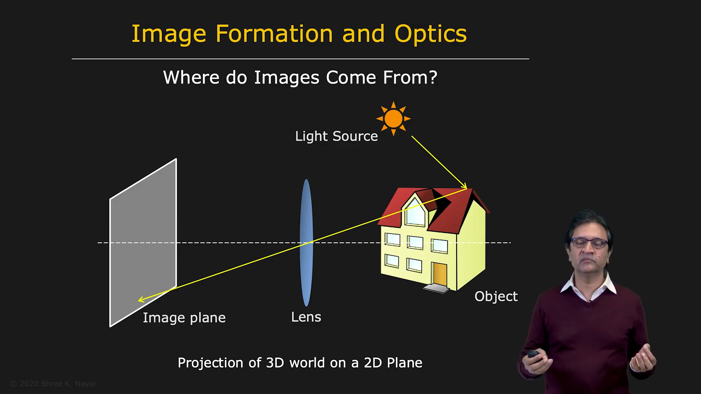

We're going to start with image formation and optics.

We're going to look at the mapping of a three-dimensional world to a two-dimensional plane using a lens.

So where do images come from? And what is the relationship between the position of a point in 3D and its projection in its 2D image? And for that matter, how does the brightness of a point in 3D relate to its brightness in the image as a creation of an optical image.

---

## Convert Optical Images to Electrical Signals

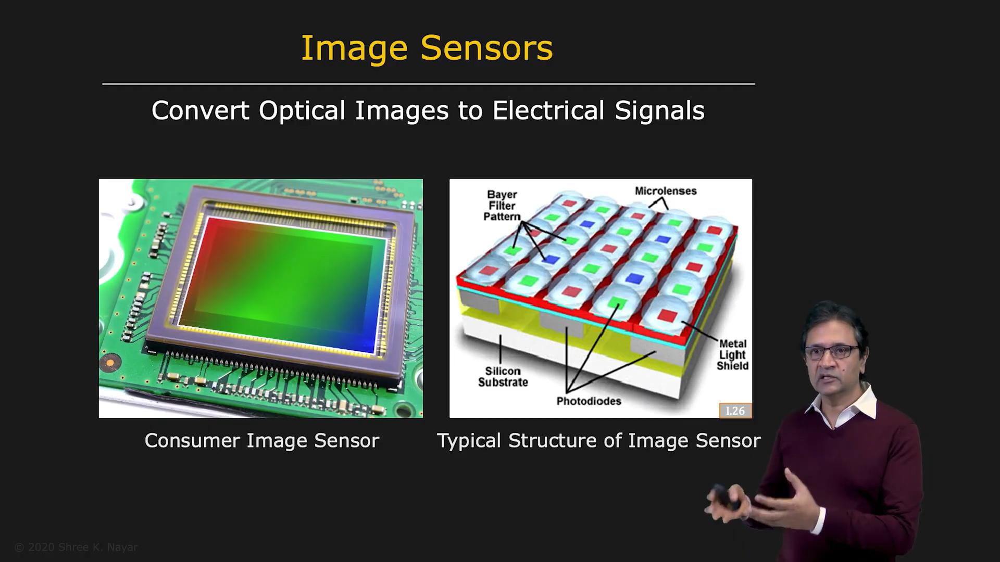

So once we have an optical image, we think about how to map this image, to record it, and create a digital image. And this is done using image sensors.

By the way, image sensor technology has made tremendous advances in the last two decades. In fact, that is one of the main reasons, we are witnessing this digital imaging revolution that we're living in this point in time.

So we look at different types of image sensors and how they actually convert optical images to digital images.

---

## Binary Images

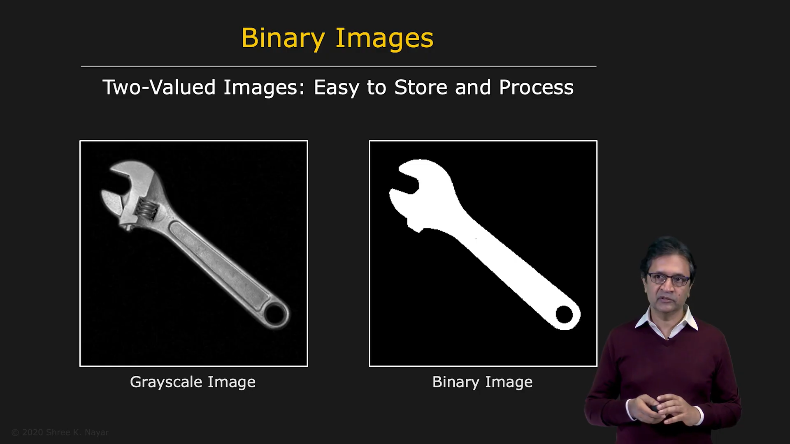

Then we look at the simplest type of image that you can deal with. It's called a binary image. These are two valued images.

For instance, the image on the left shown here, you can simply threshold it to create the image on the right. This is often possible in very structured environments, like factory automation or manufacturing lines, where you can control both the illumination and the background. Simple thresholding can give you a nice, clean silhouette or binary image of the object.

So once you have this binary image, very easy to store, easy to process. You can robustly compute properties of the object, and therefore, create some very effective vision systems.

---

## Image Processing

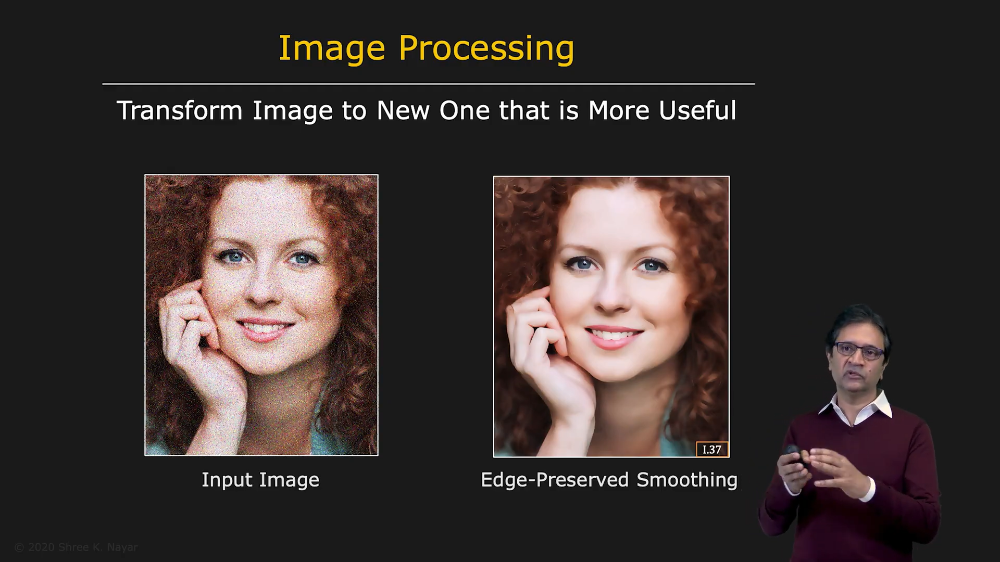

Next, we look at image processing.

Coming back to general gray-scale or color images, how do we transform an image into a new image that is more amenable to higher levels of visual processing.

So we're going to devote two lectures to image processing.

Here's an example. You have an image on the left that you see here. And you can see it's very grainy. It has a lot of noise. And by applying image processing tools, you can get the image on the right where pretty much all the noise is gone. And at the same time, the visual features, the edges, and the colors are all preserved.

So we'll come up with an entire suite of image processing tools that we can have at our disposal as we go into higher levels of visual processing.

---

## Feature Detection

### Edge and Corner Detection: Detecting Intensity Changes in the Image

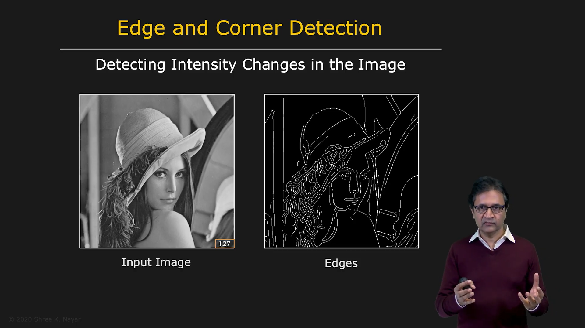

So then we're going to look at feature detection.

And the first features we're going to look at are edge detectors and corner detectors. We'll develop a framework for edge detection, a theory of edge detection. And based on this theory, we'll develop a few different types of edge and corner detectors.

---

### Finding Continuous Lines from Edge Segments

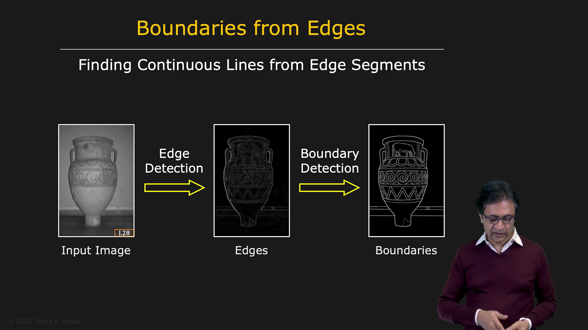

Now, when you apply an edge detector to an image such as the one on the left here-- in the center you have, what we call, an edge map, the strength of the edge at each point.

Well, when you and I take a look at this, we can immediately figure out which edges belong to the same boundaries or contours. But that's because the brain is doing it for us. But, actually, this is just a set of edges. And we need to go from these edges to boundaries such as the one shown here.

So we will develop algorithms for boundary detection.

---

### 2D Recognition using Features: Matching using "Interesting Points"

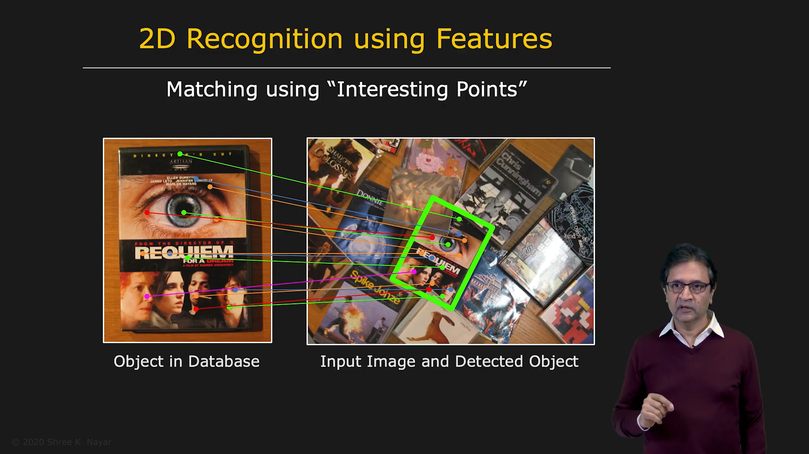

And then, we're going to spend some time looking at a specific detector which is very powerful. It's called the SIFT detector. Scale-invariant feature transform.

So you see on the left here, all the dots that you see, the colored dots, these are SIFT features that have been detected by the algorithm. They don't seem to be attached to edges per se but actually to blobs or interesting areas in the image. And you can very robustly find these, even when the object is translated or rotated or scaled. And that makes it really useful for recognition problems.

So, for instance, in the image on the right, you see the same object not only transformed, geometrically, but also obstructed partially. And yet, you're able to match these features and find the object very effectively, very robustly.

So we look at SIFT features.

---

### Image Alignment and Stitching: Combine multiple photos to create a larger photo

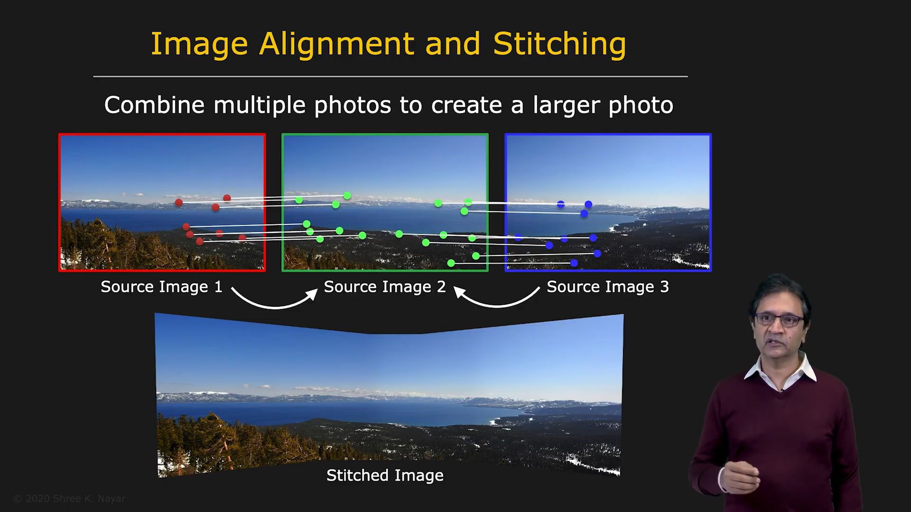

And then we look at a couple of applications, popular applications of feature detection.

So here is one which is the creation of a panorama from a set of images taken from roughly the same viewpoint but by rotating the camera. So these are overlapping images. We apply feature detection to these images. These are the features that you see here. And then from these three images, we are able to create a seamless panorama, wide-angle panorama, of the scene. This is an algorithm that sits on most smartphones these days. And we will see exactly how it works.

---

### Face Detection

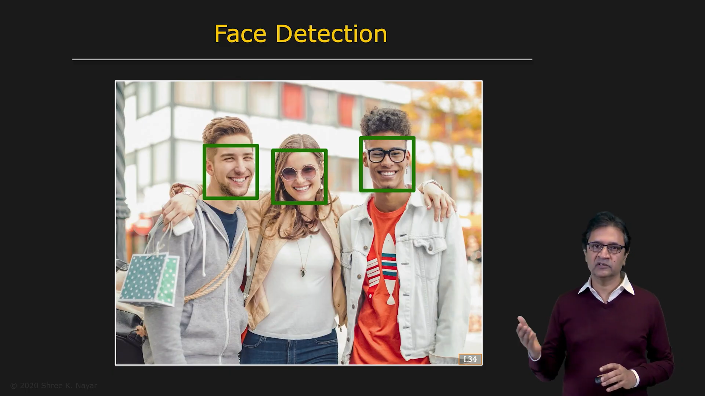

Next, we'll talk about the popular problem of face detection.

Faces, needless to say, are very important. We'll develop a detector that can actually find faces and images under varying illumination conditions and pose conditions.

---

## 3D Reconstruction: From 2D to 3D

Everything we've discussed thus far focuses on extracting information on the image plane that is in 2D.

Next, we're going to lay the groundwork for developing algorithms that recover a three-dimensional structure of a scene from one or more images. So we're going to now go from 2D to 3D.

---

### Radiometry and Reflectance

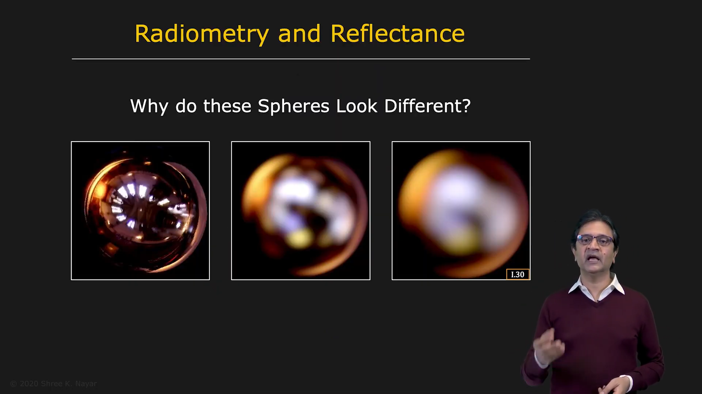

So in this context, we're going to start with the radiometry and reflectance.

Radiometry is about measuring light, to be able to define how bright a surface is, how intense a light source is.

Once we have radiometric definitions in place, we look at what's called reflectance. Why does silk look the way it does? And why does it look different from velvet? What are the reflectance models that drive these different manifestations of scattering of light?

So will define a few different reflectance models that will come in really handy.

---

### Photometric Stereo

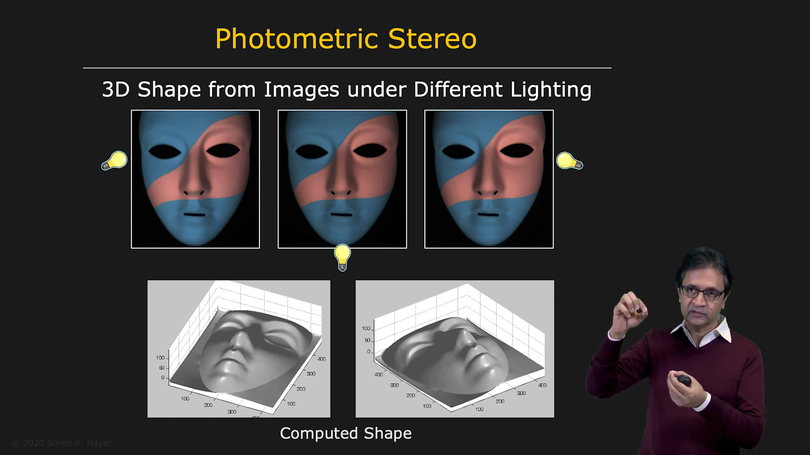

Next, we'll take a look at photometric stereo which is the first method we're going to describe for recovering 3D shape information from images of an object taken under different lighting conditions.

So you have a three-dimensional object, you're looking at it from the same direction but you light it from different known directions. And just the change in brightness at each point, in the stack of images, allows you to compute the surface normal that each point on the surface. And then you can, if it's a continuous surface, integrate the surface normals to get the three-dimensional shape which is shown in the bottom here.

---

### Shape from Shading: 3D Shape from a Single Image

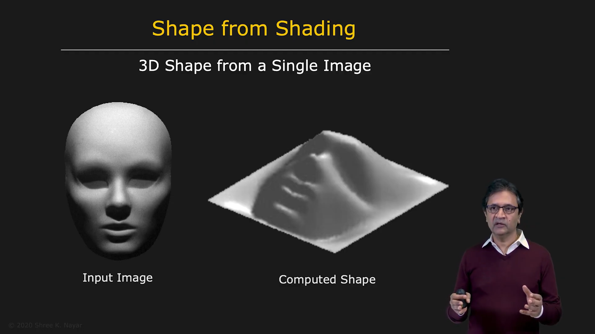

And then after that, we're going to look at the more challenging problem of shape from shading.

The shape from shading, you're trying to recover a three-dimensional shape information from a single shaded image of the object. Very challenging problem.

And in fact, it doesn't have a solution without throwing in additional constraints or assumptions. So we look at what assumptions are reasonable to make. And then develop an algorithm that takes you from the image on the left to the three-dimensional shape on the right.

---

### Depth from Focus and Defocus

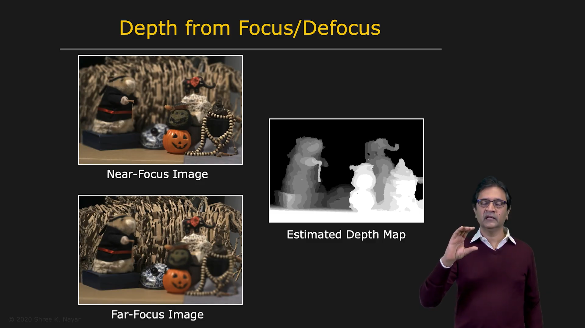

Now, you may have noticed that when you look through a lens in say, for instance, a large digital SLR camera. And you change the focus setting of the lens. You see that points in the scene come into focus and go out of focus. And when exactly a point comes into focus has something to do with the distance of the point from the camera.

And so we develop algorithms that can take a small number of images with different focus settings and recover the three-dimensional structure of the scene.

So here you see, a near-focused image and a far-focused image. And from these two images, we are able to compute this detailed depth map, distance map, where the closer the point is, the brighter it is.

---

### Active Illumination: Using Patterned Lighting to Recover Shape

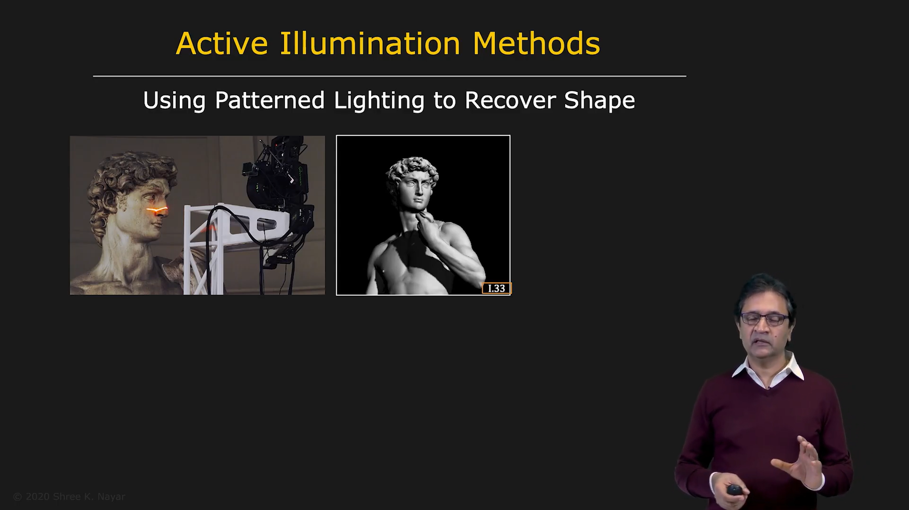

And then, we're going to talk about active illumination.

I would say that in order to make vision really robust, whenever possible, one should use active illumination. Say, for instance, in a assembly line or some kind of a conveyor belt situation. You can actually control the lighting in these scenarios. And when you can, you should. Because when the illumination of a scene can be controlled, you can recover three-dimensional information on material properties of the scene with much greater robustness and accuracy than you can without controlling the illumination.

So here you see Michelangelo's David, the statue. And it's being scanned using active illumination technique. And you get this 3D model that you see on the right. And it's a very precise model. In fact, if you take a close look at it, you see, for instance, David's eye. All the different surface undulations of captured with great fidelity.

---

### Camera Calibration: Estimating Camera Parameters

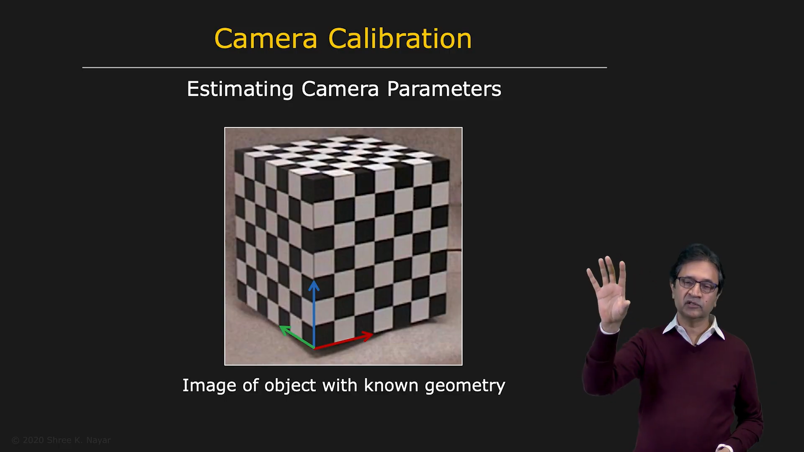

And now we're going to talk about camera calibration.

In order to go from an image, where things are measured in pixels, back into the three-dimensional scene where things may be measured in millimeters. You really need to know the mapping. And this mapping is determined by a small number of camera parameters, its focal length here for instance, but many other parameters.

It turns out that a single image of an object of known structure, such as this cube shown here, is enough for you to determine all the camera's parameters.

---

### Binocular Stereo: Computing Depth using Two Views

So with the camera calibrated, we can now come up with techniques for recovering three-dimensional structure from two or more images of a scene.

The first approach we're going to look at is binocular stereo.

So do this little experiment with me. You have two hands. You stick your index fingers out. Hold one hand in front of you. And then shut one of your eyes. Now, take your other hand. And you're going to bring it from behind you really fast. And try and see if you can make the two index fingers meet. And you find that it's pretty hard with one eye closed but much easier if you have two eyes open.

So the reason is that we use two eyes to actually perceive the depth of the three-dimensional scene. The two eyes capture two slightly different images. And those differences in these images is what we use to perceive depth.

And so we look at how we can develop algorithms that can recover depth from two or more images taken from different viewpoints.

Here you see your binocular stereo system with two cameras. There's a right view here and a left view. And from just these two views, we can compute this depth map shown here where the brighter the point is, the closer it is to the camera.

---

## Motion and Optical Flow

### Determining the Movement of Scene Points

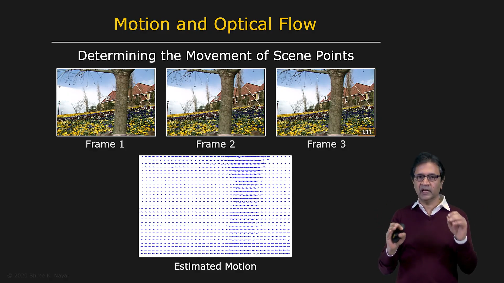

Now thus far, we have assumed that the scene is essentially static, not moving. But we know that everything is moving, essentially, all the time. And so motion is really important and something that we'd like to measure.

So what you're seeing here on the top is three images taken while the camera moves just slightly. So actually, the tree and the house and everything else is slightly displaced from frame to frame but displaced differently depending on how far they are.

So if you have a point moving in three-dimensional space, it's projection onto the image is called its motion field. And when you can see this motion in the image, when it's measurable, it's called optical flow. We'll develop an algorithm for optical flow. And here you see optical flow vectors for this particular scene where the length of the vector tells you how fast it's moving. And the direction is telling you which direction it's moving in.

---

### Structure from Motion

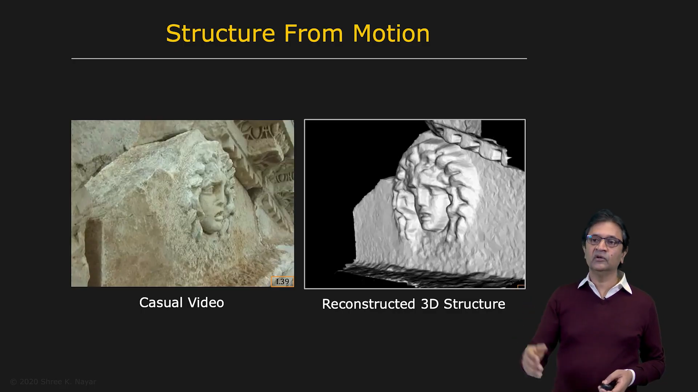

And next, we're going to talk about structure from motion.

Here's an interesting fact. If you take a camera and you move it around an object, like this one right here-- you see the camera being moved around this little sculpture, but it's being moved in an uncontrolled fashion. It's just a hand-held video so to speak. So you don't know the relative position of the camera from one frame to the next. But it turns out that even with this casual video, you can recover the three-dimensional structure of the scene. And what's interesting is, in addition to that, you can also determine how the camera moved in three-dimensional space.

This problem is called structure from motion. And we'll develop algorithms for structure from motion.

---

## Visual Perception

Now with that, we will conclude 3D reconstruction and move on to the problem of perception.

---

### Image Segmentation: Group pixels with similar visual characteristics.

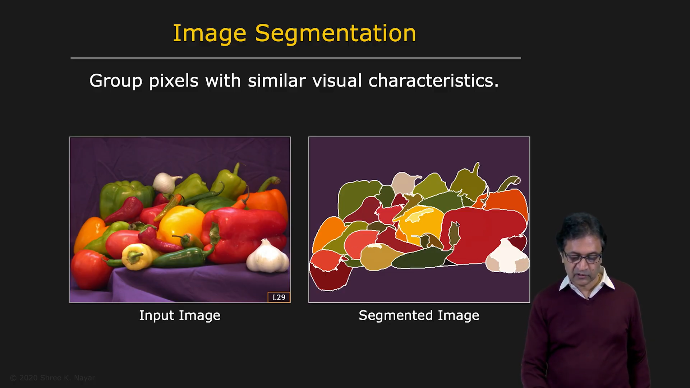

The first problem in perception we want to look at is image segmentation, a really hard problem.

The segmentation problem is grouping pixels together that have similar visual characteristics.

So for instance, in this image that you see right here, you want to come up with segments where each segment corresponds to its own a specific individual vegetable, or pepper in this particular case. And you see that the algorithm comes up with this segmentation right here.

It's a hard problem because exactly what pixels belong to the same object has a lot to do with context. For example, if I'm wearing a hat, is the object me with the hat on? Or is the hat a separate object from me? Depends on the context to a certain extent.

So image segmentation is an ill-defined problem and we'll see how we can come up with simple metrics for the similarity between pixels in an image and use that to come up with reasonable solutions for the segmentation problem.

---

### Object Tracking: Determining the Movement of Objects in Videos

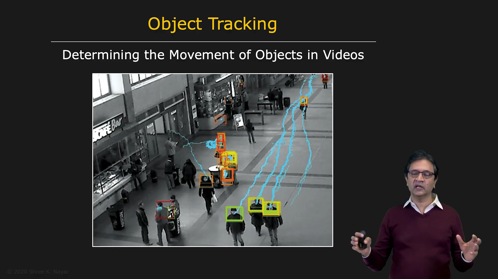

Another perception problem we want to talk about is tracking.

We want to be able to follow moving things through space and time. And of course, if it's a very clean video of somebody walking down a street that would be an easy problem. But when you look at, say, for instance, a person walking through the crowd in say Grand Central Station, that's a really challenging problem. Because this person can go hidden from you at times, can be obstructed by other people, go behind a wall or a pillar.

And so we want to be able to develop algorithms that can robustly follow this person over space and time. And that's the object tracking problem.

---

## Recognition

And then, finally, we are going to devote two lectures to the problem of recognition.

---

### Appearance Matching: Object Recognition using Principle Component Analysis

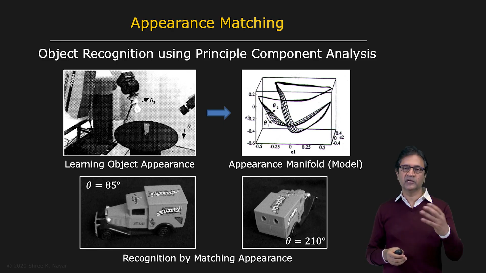

The first one is based on appearance matching.

If I show you this object right here and I say, "Memorize it", what you would possibly do is pick up the object and look at it from different directions. And these images that you're looking at, you would somehow use that to create a representation in your mind. And then when I show you this object again, you wouldn't know that it is actually the object you saw before.

Well, we use a similar technique here which we call appearance matching. Here you see a little toy truck. It is shown to the camera under different orientations and under different lighting conditions so a large number of images are captured. But then, that is too big a representation to hold in memory, so we use the mathematical technique called Principle Component Analysis to reduce the dimensionality of this data and come up with a very compact appearance manifold which is shown here on the right.

Now, if this object appears in a scene and you are able to segment it out, you can then use this appearance manifold to figure out whether it is indeed that object and what its supposed illumination might be.

---

### Artificial Neural Networks: Using Network of Neurons to Solve Complex Problems

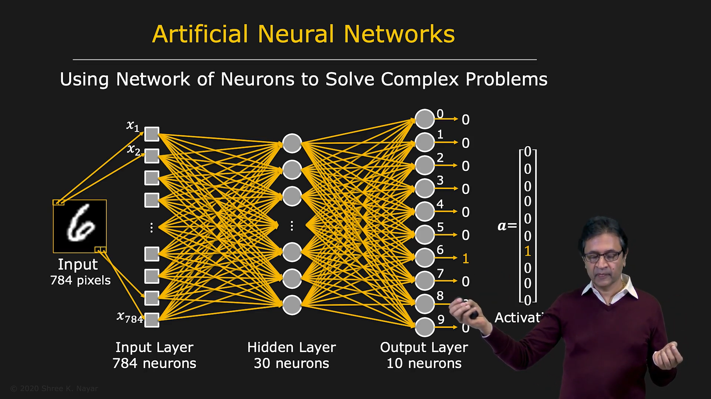

And then, finally, we're going to conclude with artificial neural networks.

These are very popular these days. And we are going to show how you can construct a neural network to perform a complex mapping from an input image to an output result that we are looking for.

We'll start with describing what a neuron is. And then go into how we can construct a neural network. And finally, talk about the mathematics behind the back propagation algorithm which is used to train these networks from data that's given.
