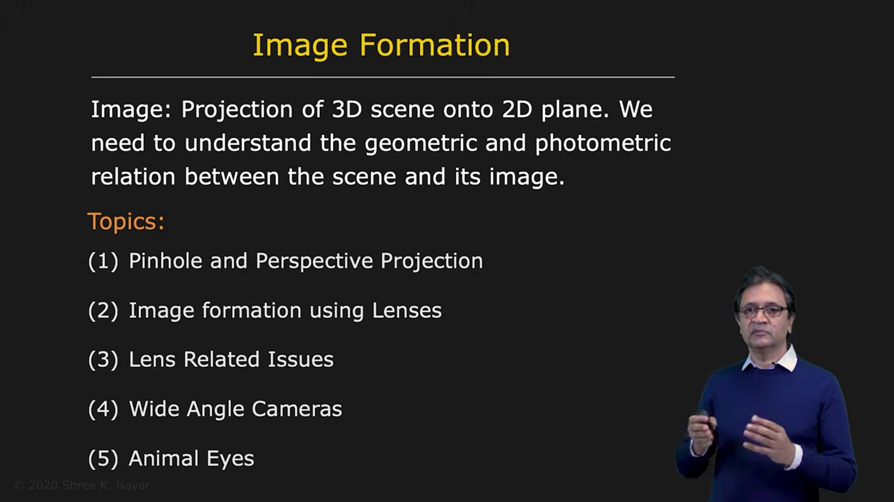

# Image Formation: Overview

The first topic we will cover is image formation.

Image formation is the process of projecting a three-dimensional scene onto a two-dimensional image plane.

To understand this process, we need to study both:

* the geometric relationship between points in the scene and their locations in the image
* the photometric relationship between scene brightness and image brightness

---

## 1. Geometric and Photometric Relations

### Geometry

Given a point in the 3D world, we want to know where it appears in the image.

This leads to the study of camera geometry, projection models, and image coordinates.

### Photometry

Given the brightness or color of a point in the scene, we want to understand what appears in the captured image.

This includes the effects of illumination, surface reflectance, and camera response.

---

## 2. Pinhole Camera

<!--  -->

We begin with the concept of a pinhole camera.

This is the simplest type of camera you can imagine. It has a long history in optics and is the foundation of modern camera geometry.

A pinhole camera forms an image by allowing only a single ray from each scene point to pass through a small aperture and strike the image plane.

This gives us the basic model for perspective projection, which is one of the most important concepts in computer vision.

---

## 3. Perspective Projection

Perspective projection describes how a 3D point is mapped to a 2D image point.

This is the mathematical foundation for understanding how the world is projected onto an image.

We will derive the projection equations and analyze the visual consequences of perspective projection, such as:

* size changing with depth
* parallel lines appearing to meet
* vanishing points

---

## 4. Why the Pinhole Camera Is Not Enough

Although the pinhole camera is elegant and produces very sharp images, it gathers very little light.

Because the aperture is extremely small, the amount of light entering the camera is limited.

This leads to long exposure times and poor image brightness.

To solve this, we move from pinhole imaging to lens-based imaging.

---

## 5. Lenses and Image Formation
<!-- 
 -->

Once we understand the pinhole model, we study real cameras that use lenses.

Lenses allow more light to enter the camera while still producing a focused image.

We will examine:

* focal length
* aperture and F-number
* focus and defocus
* depth of field
* lens design and optical behavior

These properties determine how an image is formed and how sharp, bright, and clear it appears.

---

## 6. Lens Imperfections and Aberrations

Even if a lens is manufactured very carefully, it is not perfect.

Real lenses suffer from optical aberrations and geometric distortions.

These effects can degrade the image by introducing:

* blur
* chromatic effects
* geometric distortion
* loss of sharpness at image edges

We will study how these distortions arise and how they can be corrected.

---

## 7. Large Field-of-View Imaging

Next, we move beyond simple perspective projection.

Some applications require very wide fields of view, such as hemispherical or panoramic imaging.

A standard perspective camera cannot capture such a wide field without distortion or severe limitations.

To address this, we study:

* wide-angle lenses
* fisheye optics
* mirror-based imaging systems
* combinations of lenses and mirrors

These designs allow us to capture a much larger portion of the visual world.

---

## 8. Biological Eyes and Nature's Designs

<!--  -->

Finally, we study biological eyes.

Nature has evolved many remarkable optical systems, and the human eye is one of the most sophisticated examples.

We will explore how biological vision differs from artificial imaging systems and what features make the eye so effective.

This includes:

* the structure of the eye
* how light is projected onto the retina
* how the visual system processes the incoming signal
* the relationship between biological optics and computer vision

---

## 9. Summary

The study of image formation begins with the simplest model: a pinhole camera.

From this basic idea, we build the mathematical understanding of:

* projection geometry
* perspective
* camera models
* lens optics
* depth of field
* wide-angle imaging
* biological vision

This is the foundation for all of computer vision.

Without understanding image formation, it is impossible to develop reliable methods for measuring, interpreting, and reconstructing the world from images.

---

## 10. Final Note

Image formation connects the three-dimensional world to the two-dimensional image. It is the starting point of computer vision.

From pinhole geometry to lenses, from optics to biological eyes, this topic gives us the conceptual and mathematical tools needed for everything that follows.