# Image Formation: Pinhole Camera and Perspective Projection

A 3D scene is projected onto a 2D image plane by a camera. The simplest mathematical model of this process is the pinhole camera. 

---

## 1. Why Do We Need a Pinhole?
| | |
|--|--|
| 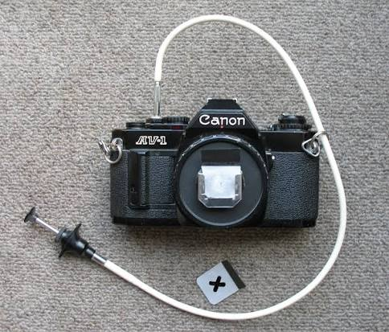 | 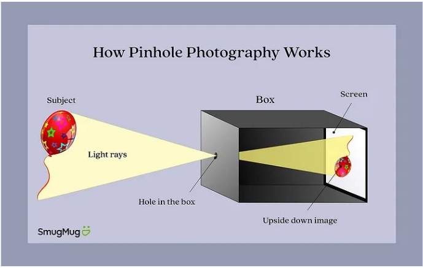 |

Consider a 3D scene on the right and a screen or image plane on the left. If light from many points on the object falls on the same region of the screen, the result is a blurred and confused image.

To obtain a sharp image, we place an opaque sheet with a tiny hole between the scene and the image plane. This small opening allows light from each point in the scene to pass through one unique ray and strike a single point on the image plane.

This is the basic idea behind a pinhole camera.

---

## 2. Pinhole Camera Model

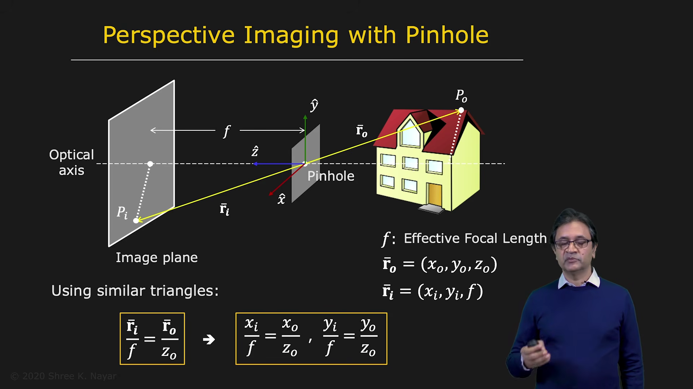

A pinhole is placed between the scene and the image plane. The camera coordinate system is fixed at the pinhole.

Let:

- P0 = a point in the 3D scene
- Pi = its corresponding point on the image plane
- f = effective focal length, i.e. the distance between the pinhole and the image plane
- z0 = depth of the 3D point with respect to the camera

We set the camera coordinate frame at the pinhole, with the z-axis aligned with the optical axis. The image plane is perpendicular to the z-axis and lies at z = f.

The 3D point is written as:

r_0 = (x0, y0, z0)

The image point is written as:

r_i = (xi, yi, f)

Because the triangles formed by the point, the pinhole, and the image plane are similar, we get the equations In vector form:

 r_i/ f = r_0 / z_0

where r_0 = (x_0, y_0, z_0) and r_i = (x_i, y_i, f).

This is the fundamental geometry of image formation in a pinhole camera.
---

## 3. Understanding Perspective Projection

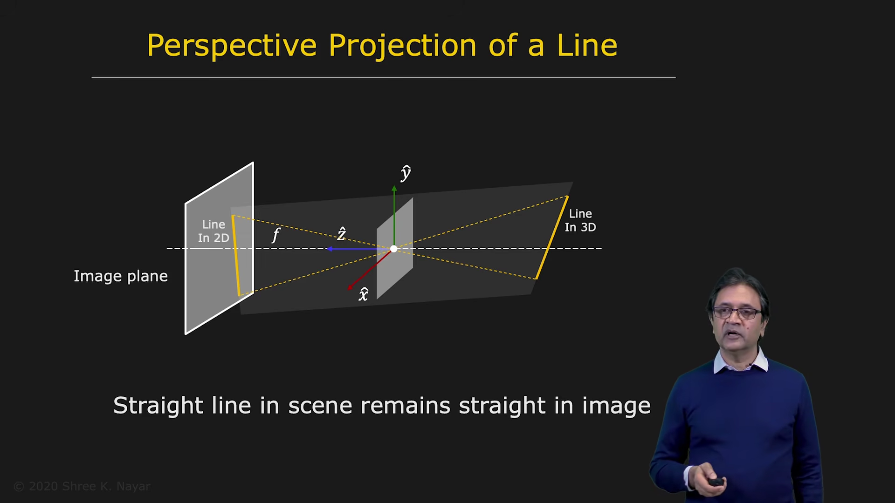

Perspective projection is not just a simple scaling. It depends on depth.

A point farther away from the camera produces a smaller image. A point closer to the camera produces a larger image.

This is why objects appear to change size with distance.

---

## 4. Image Magnification

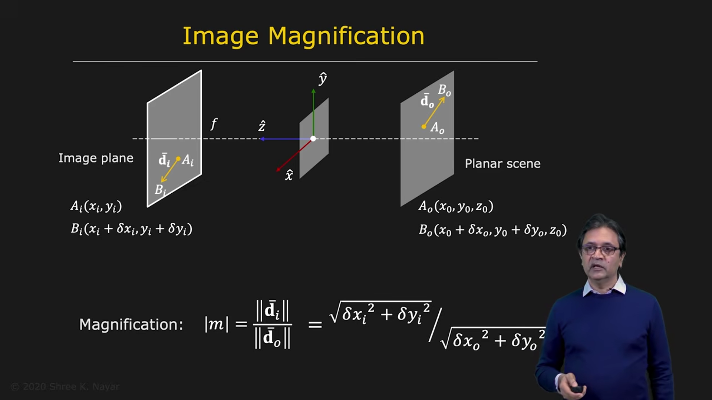

Suppose an object segment in the scene has length d0. Its projected image length is di.

The magnification m is defined as:

m = d_i / d_0

| | |
|--|--|
|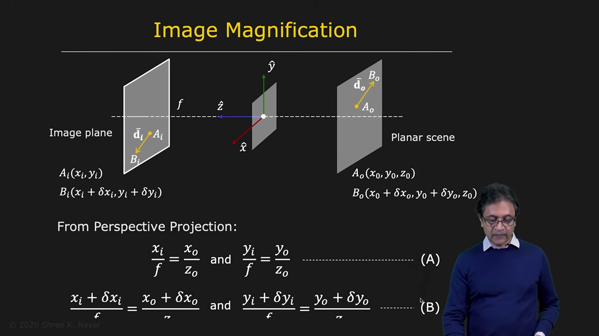 | 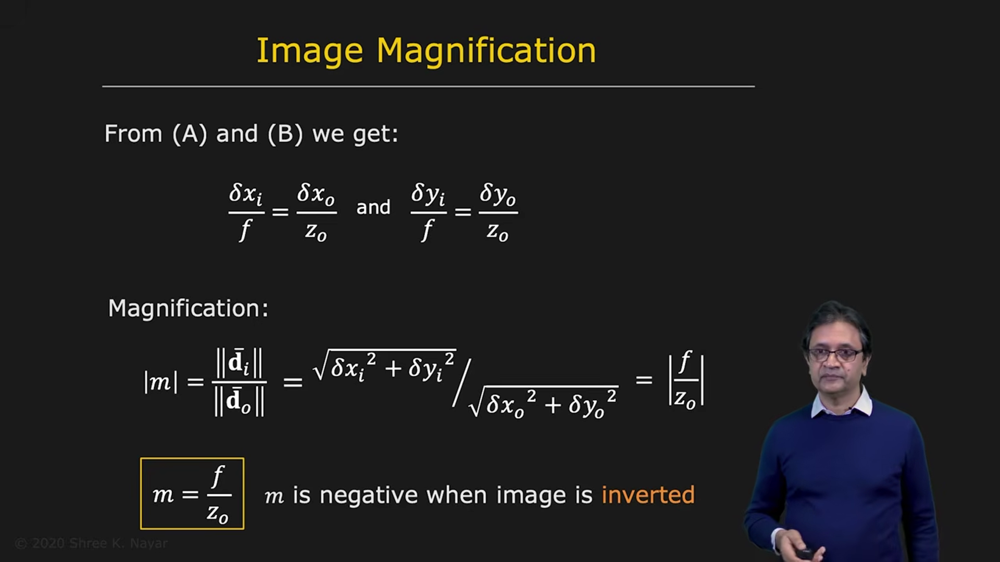 |

From the perspective projection equations, one can derive:

m = f / z_0

The absolute value of magnification is:

|m| = f / z_0

This means:

- larger objects closer to the camera produce larger images
- farther objects appear smaller
- image size decreases inversely with depth

The sign of m indicates whether the image is upright or inverted. For a standard pinhole camera, the image is inverted, so the sign is negative.

---

## 5. Consequences of Perspective Projection

### 5.1 Parallel Lines Meet at a Vanishing Point
| | |
|--|--|
|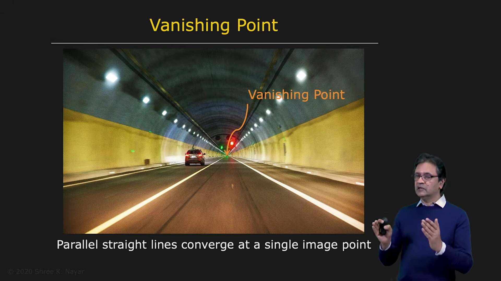 | 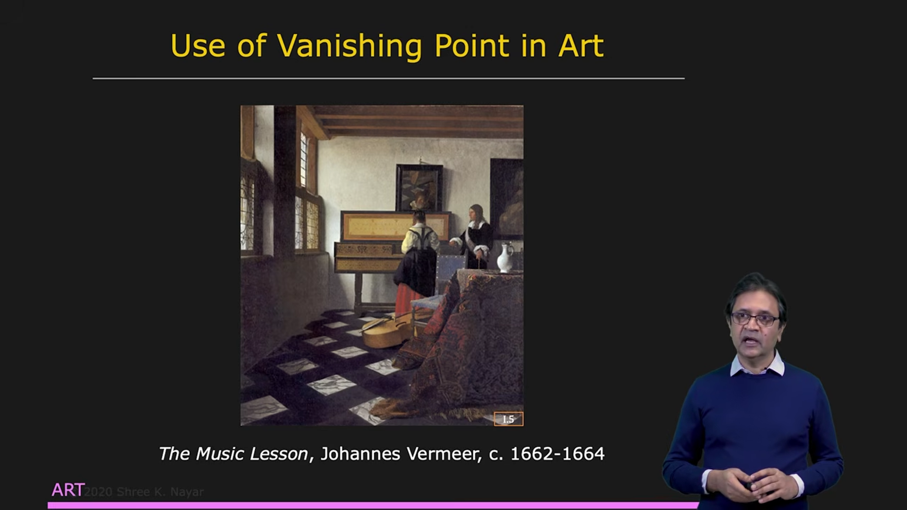 |

In the real world, two parallel lines in 3D remain parallel. However, in an image, they often appear to meet at a single point.

This point is called the vanishing point.

For a set of parallel lines in 3D, the vanishing point is the projection of a ray that starts at the camera center and follows the same direction as those parallel lines.

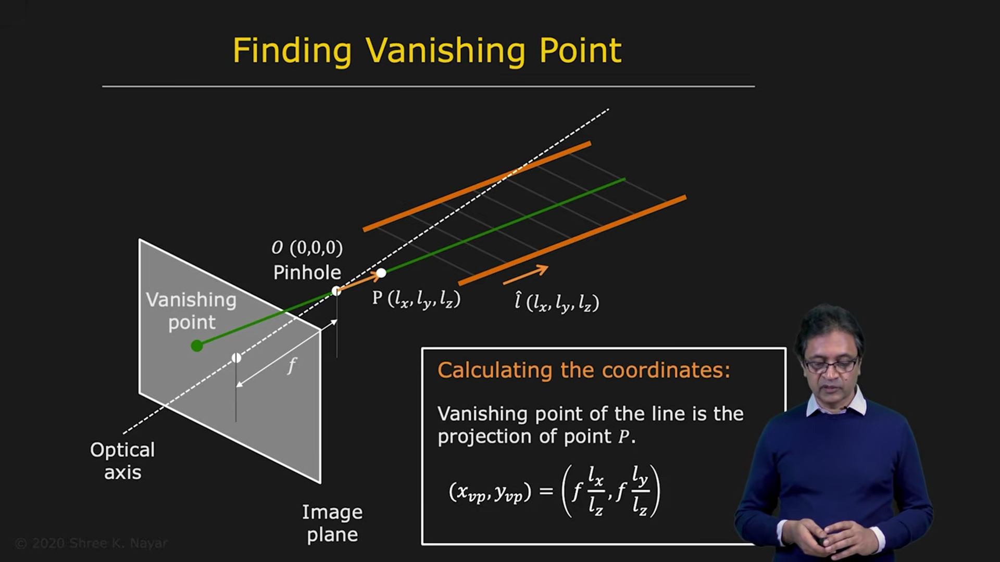

If the direction vector of the lines is:

l = (lx, ly, lz)

then the vanishing point is the image of a point:

P = (l_x, l_y, l_z)

projected through the pinhole.

So:

x_vanishing = f * l_x / l_z

y_vanishing = f * l_y / l_z

This is why railroad tracks, corridor edges, and building edges appear to converge in photographs.

---

### 5.2 Objects Look Smaller at Larger Distances

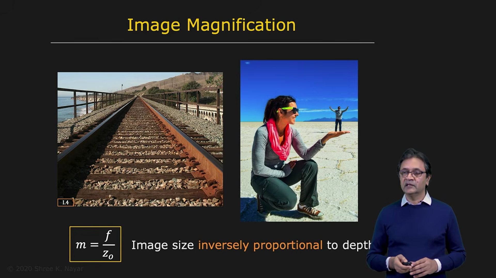

Since magnification depends on depth, an object at a greater distance from the camera appears smaller than the same object when it is closer.

This effect is one of the key visual cues that helps the human brain understand the three-dimensional structure of a scene.

---

## 6. Camera Obscura

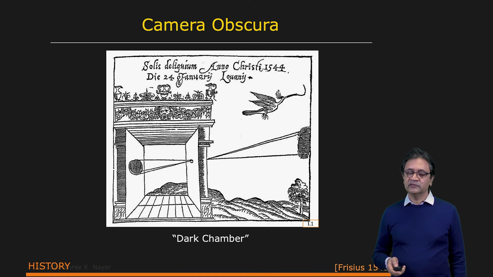

The idea of a pinhole camera is ancient.

The concept was discussed by Chinese philosophers around 500 BC. Later, the Arab scientist Alhazen wrote a major book on optics called Kitab al-Manazir around 1000 AD.

The idea became popular in Europe during the 16th century, especially among artists. It was used as a tool to create accurate drawings of 3D scenes.

The device was called camera obscura, which means "dark chamber" in Latin.

This was one of the earliest ways to create a projected image of the real world.

---

## 7. Nature Already Used Pinhole Imaging

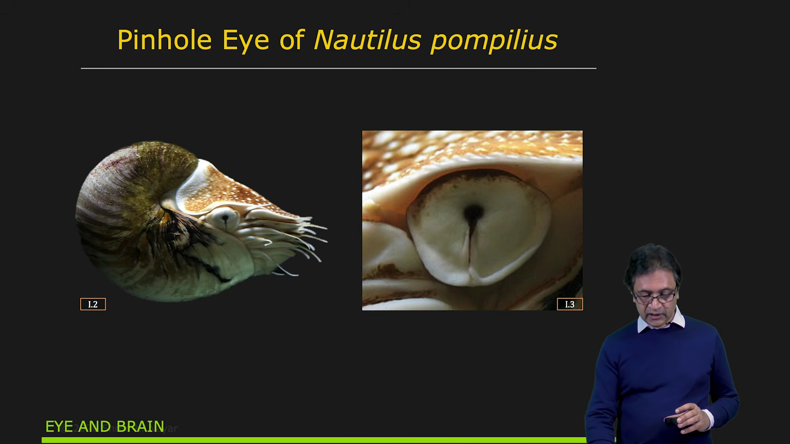

The eye of Nautilus pompilius is a pinhole-like eye. It contains a small opening and does not use a lens.

This shows that the pinhole principle is not just a human invention; nature also uses it.

---

## 8. What Is the Ideal Pinhole Size?

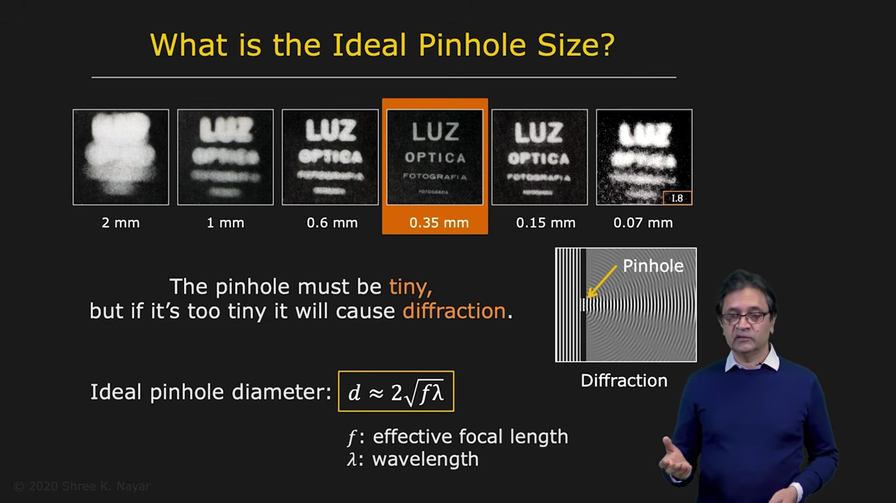

A pinhole should be as small as possible for a sharp image, but not too small.

If the hole is too large, many rays from each scene point pass through the aperture, producing blur.

If the hole is too small, diffraction occurs. Light waves spread out at the edge of the aperture, and the image becomes blurry again.

So there is an optimal pinhole diameter.

A good approximation is:

d ≈ 2 * sqrt(f * λ)

where:

- d = pinhole diameter
- f = focal length
- λ = wavelength of light

For visible light, λ is about 550 nm on average.

This gives an ideal pinhole size for a reasonably sharp image.

---

## 9. The Trade-off: Sharpness vs Exposure

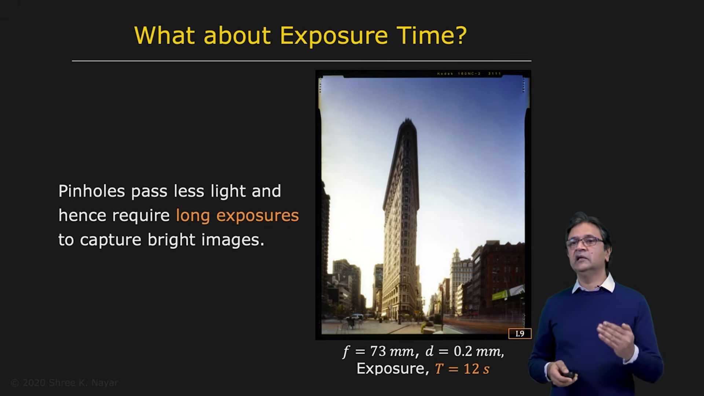

A pinhole camera has one important disadvantage: it lets in very little light.

Because the opening is tiny, the exposure time becomes very long.

For example, a well-designed pinhole camera may require several seconds or more to capture a single image.

This is the main reason we use lenses in real cameras. Lenses gather more light and allow much shorter exposure times.

Even so, pinhole cameras are useful because they are simple, cheap, and produce excellent focus everywhere.

---

## 10. Summary

The pinhole camera is the simplest model of image formation.

It explains how a 3D point projects to a 2D image point using perspective geometry.

The key equations are:

x_i = f * x_0 / z_0

y_i = f * y_0 / z_0

and the magnification is:

m = d_i / d_0 = f / z_0

These ideas form the foundation of computer vision and camera geometry.

They also explain why:

- objects farther away look smaller
- parallel lines appear to meet
- perspective is central to image formation

---

## 11. Final Note

Pinhole imaging is elegant because it captures the basic geometry of vision without using a lens. It is one of the most important starting points for understanding computer vision.

The next step is to extend this model to real cameras, which use lenses to gather more light while keeping the same perspective projection principles.

---

End of lecture.