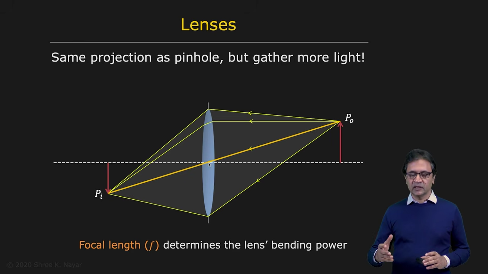
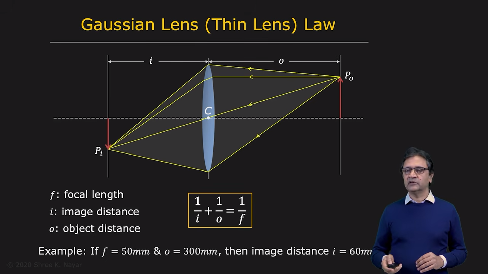
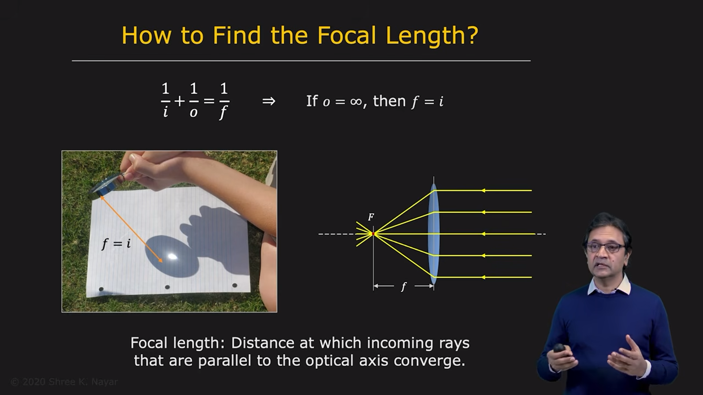
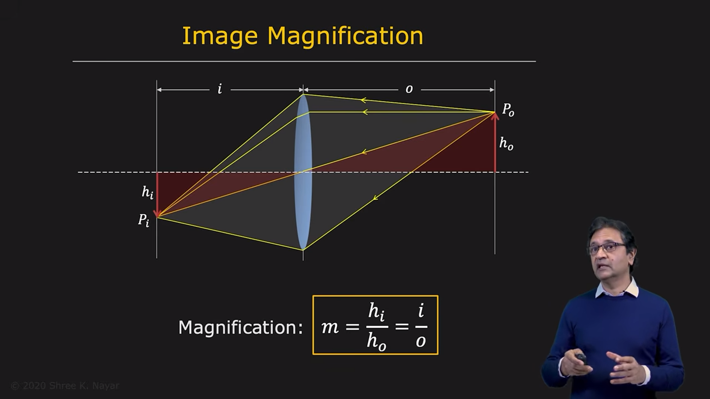
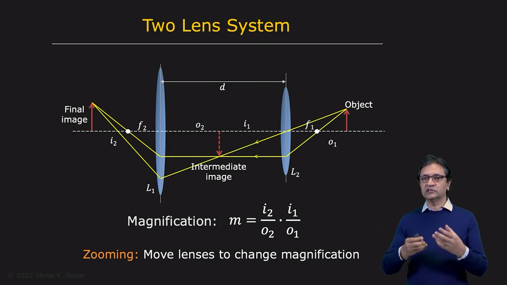
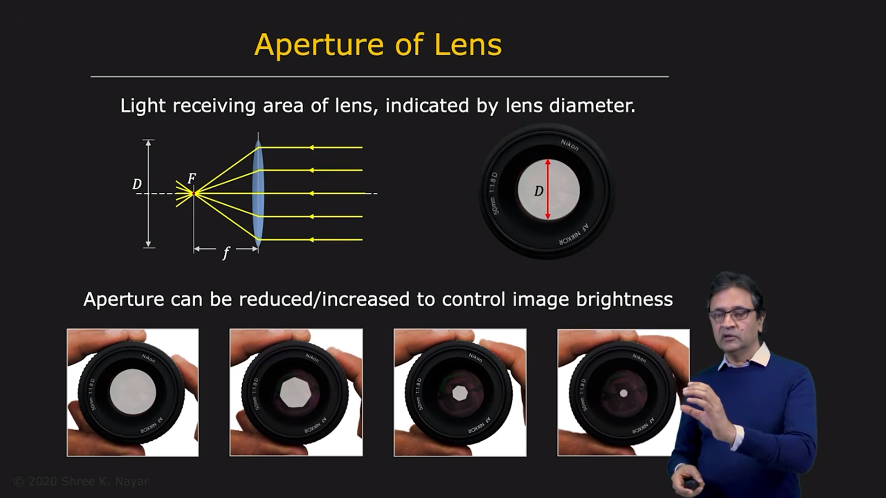
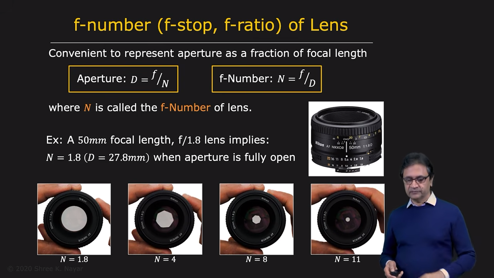
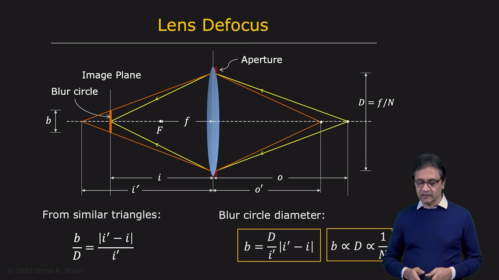
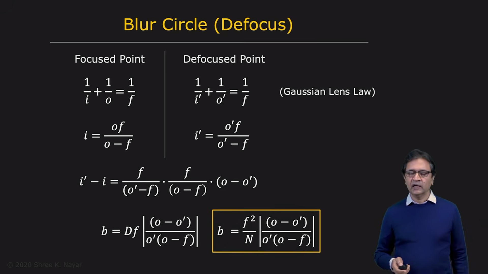
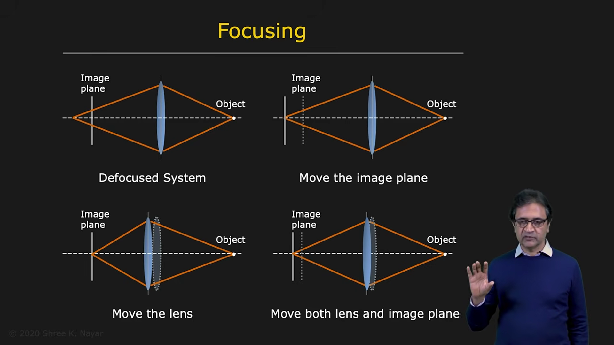

# Lenses

Now let us look at how an image is formed using a lens.

A lens performs the same basic projection as a pinhole camera: it creates a perspective image of a 3D scene. The important difference is that a lens gathers far more light than a pinhole, so it can form a bright image in a much shorter time.

---

## 1. How a Lens Forms an Image

Consider a point in the scene, P0.

Light rays coming from P0 strike the lens. The lens refracts, or bends, these rays so that they converge at a point Pi behind the lens. That point is the focused image of P0.

So, for each scene point, the lens sends its rays to a corresponding image point.

This is the same perspective idea as in a pinhole camera, except that the lens collects many rays instead of only a single ray.

---

## 2. Gaussian Lens Law

Let:

- o = object distance from the lens
- i = image distance from the lens
- f = focal length of the lens

For a thin lens, the Gaussian lens law is:

1 / f = 1 / o + 1 / i

This relationship tells us how the object distance and image distance are related to the focal length.

Example:

If the focal length is 50 mm and the object is at 300 mm, then:

i = 60 mm ( using above formula)

So the image is formed at 60 mm behind the lens.

---

## 3. How to Find the Focal Length

If the focal length is not given, it is easy to estimate.

Use the Gaussian lens law:

1 / f = 1 / o + 1 / i

If the object is very far away, then o is effectively infinite:

1 / o ≈ 0

So:

1 / f ≈ 1 / i

which gives:

f ≈ i

This means that when an object is at infinity, the image is formed at the focal plane.

So, to find the focal length of a lens, simply place a distant object, such as the sun or a very far point light source, in front of the lens and locate the focused image. The distance from the lens to the focused image is the focal length.

---

## 4. What Determines the Focal Length?

The focal length depends on the optical properties of the lens.

Two main factors determine it:

* the refractive index of the material
* the shape of the lens

Typical lenses are made of transparent material such as glass or plastic. The refractive index of the material strongly affects the bending power of the lens.

The shape of the lens also matters. A lens usually has two curved surfaces, often spherical. The radii of curvature of these two surfaces determine how strongly the lens bends light.

Therefore:

f depends on both:
- material
- geometry of the lens surfaces

---

## 5. Image Magnification

Now consider an object of height h0 placed at distance o from the lens. Its image has height hi at distance i.

The magnification m is defined as:

m = hi / h0

Using similar triangles, we obtain:

hi / h0 = i / o

So the magnification is:

m = i / o

This means:

- if the image is larger than the object, magnification is greater than 1
- if the image is smaller than the object, magnification is less than 1
- if the image is inverted, the sign is negative in a more formal sign-convention model

This is the basic idea behind magnifying systems.

---

## 6. Two-Lens System and Zooming

Consider a system with two lenses: L1 and L2.

An object is first imaged by one lens, creating an intermediate image. This intermediate image acts like a new object for the second lens.

The final image is formed by the second lens.

The total magnification of the two-lens system is the product of the magnifications of the two lenses:

m_total = m1 × m2

In terms of image and object distances:

m_total = (i1 / o1) × (i2 / o2)

This is the basic principle behind zoom lenses.

By moving the lenses relative to each other, the system can change its magnification while keeping the object and image distances within a useful range.

This is how zooming works in cameras and optical systems.

---

## 7. Aperture of a Lens

The aperture of a lens is the opening through which light passes. It determines how much light can enter the camera.

The aperture diameter is usually denoted by D.

In a real camera lens, the aperture is often controlled by a diaphragm made of several blades. These blades move together to increase or decrease the opening.

The aperture can be represented by the lens F-number.

The F-number N is defined by:

N = f / D

or equivalently:

D = f / N

So the aperture diameter is the focal length divided by the F-number.

Example:

If a lens has:

- focal length f = 50 mm
- F-number N = 1.8

then:

D = 50 / 1.8 ≈ 27.8 mm

So the aperture diameter is about 27.8 mm.

---

## 8. F-Number and Exposure

The aperture controls how much light enters the lens.

As the aperture opens wider:

- D increases
- N decreases

As the aperture closes:

- D decreases
- N increases

Thus, a lens with a smaller F-number is a faster lens because it gathers more light.

The practical relationship is that exposure is roughly proportional to:

1 / N^2

This is why a lens at f/1.8 collects much more light than a lens at f/8.

---

## 9. The Price of Using a Lens: Defocus

A lens gathers much more light than a pinhole, but it has a serious trade-off:

only one scene plane is perfectly in focus at a time.

This is the idea of focus and depth of field.

Suppose an object point is at distance o from the lens and is focused perfectly at image distance i.

Now imagine another point that is not on the plane of focus. It is at distance o' from the lens. Its image is not formed exactly on the image plane.

Instead, the rays from that point form a blur circle on the image plane. That blur circle is known as the defocus blur.

---

## 10. Blur Circle and Defocus

Let the diameter of the blur circle be b.

From similar triangles:

b / D = (i' - i) / i'

where:

- D = aperture diameter
- i = image distance of the in-focus point
- i' = image distance of the defocused point

This shows that the blur circle increases with aperture size.

In other words:

- a larger aperture produces more blur for off-focus points
- a smaller aperture produces less blur

Thus, the blur circle diameter is proportional to the aperture diameter and therefore inversely proportional to the F-number.

---

## 11. Defocus in Terms of Object Distance ( Blur Circle)

We usually know the object distances rather than the image distances.

Using the Gaussian lens law again for the in-focus object and the defocused object:

1 / f = 1 / o + 1 / i

1 / f = 1 / o' + 1 / i'

From these equations, one can derive a relation for the blur circle diameter:

b ≈ (f^2 / N) × (|o - o'| / (o o'))

This expression shows that defocus increases when:

- the aperture is larger
- the object is farther from the focused plane
- the focal length is large

This is why a wide aperture produces a shallower depth of field.

---

## 12. How Do We Focus an Imaging System?

To focus an image, we must bring the desired scene plane onto the image plane.

There are several ways to do this:

* move the image plane
* move the lens
* move both the lens and the image plane
* move the entire camera closer to or farther from the object

In practice, cameras usually focus by moving the lens relative to the sensor.

This changes the image distance i and brings the desired object plane into focus.

---

## 13. Summary

A lens forms an image in the same basic geometric way as a pinhole camera, but gathers much more light.

The key lens equation is:

1 / f = 1 / o + 1 / i

This relates:

- object distance o
- image distance i
- focal length f

The focal length depends on:

- refractive index of the lens material
- lens shape and curvature

Magnification is:

m = hi / h0 = i / o

The aperture is controlled by the lens diaphragm, and is usually described by the F-number:

N = f / D

A larger aperture gives more light but also causes more blur in defocused regions.

Thus, the lens gives us a powerful compromise:

- more light than a pinhole
- a focused image for one depth plane
- controlled blur outside that plane

This is the foundation of practical camera design and image formation in real optical systems.

---

## 14. Final Note

The lens is a major improvement over the pinhole camera because it captures more light while preserving the same perspective geometry.

This makes it possible to form bright, useful images under normal conditions.

From the Gaussian lens law to aperture control and focus, these ideas are central to understanding how real cameras work.