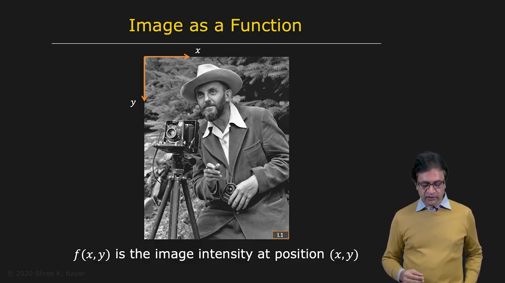
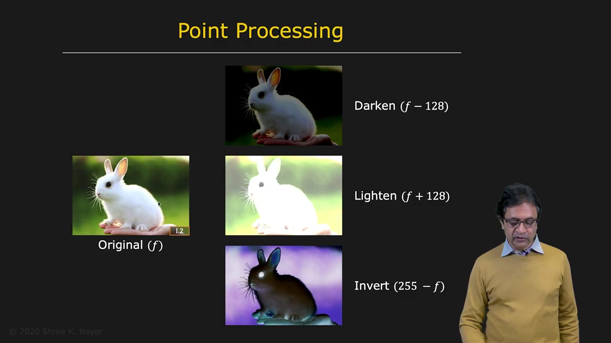
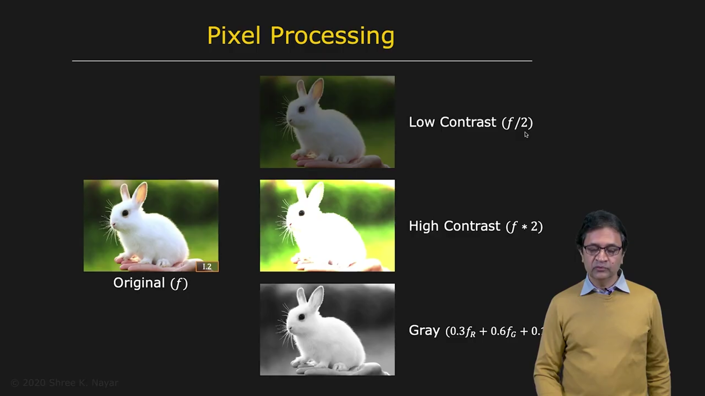

# Pixel (Point) Processing

## Representing an Image as a Function

An image can be defined as a function. The spatial coordinates are $x$ and $y$. At any given $(x,y)$, there is an intensity value $f$.

Therefore, $f(x,y)$ is the image expressed as a function.

> **Image placeholder: Image as a function**  
> Suggested visual: an image coordinate plane with a point $(x,y)$ and its corresponding intensity value $f(x,y)$.

### Color Images

If the image is a color image, it has multiple channels. For example, it may have red, green, and blue channels.

Each channel is a function, such as:

$$
r(x,y), \qquad g(x,y), \qquad b(x,y)
$$

## What Is Pixel or Point Processing?

The simplest type of processing applied to an image is called **pixel processing** or **point processing**.

| | |
|--|--|
| |  |

For each pixel:

1. Look at its brightness value.
2. Transform that brightness value based on the value itself.
3. Do this independently of the pixel's location in the image.

Thus, point processing is a mapping from one brightness value to another brightness value, or from one color to another color.

It is the simplest type of operation because, at every pixel, the operation is independent of all other pixels.

## Examples of Point Processing

Consider a color image with three channels.

### Darkening an Image

To darken the image, subtract some number from each of the three channels.

### Lightening an Image

To lighten the image, add some number to each channel.

### Inverting an Image

Suppose the image is an 8-bit image in each of its three channels. The image can be inverted by taking 255 minus the current value:

$$
f_{\text{inverted}} = 255 - f
$$

The result looks like a negative of the image.

### Lowering Contrast

If the image has a certain range of brightness values and we want to compress that range, we can divide the pixel value by 2:

$$
f_{\text{low contrast}} = \frac{f}{2}
$$

### Increasing Contrast

To increase the contrast, multiply the pixel value by 2:

$$
f_{\text{high contrast}} = 2f
$$

When increasing contrast, remember that the result cannot go beyond the dynamic range of the image itself.

For an 8-bit image, the maximum value is 255. When a value goes above 255, saturation occurs: the value is clipped at 255. This is why part of the rabbit in the example becomes saturated.

### Converting Color to Grayscale

A color image can be converted to a grayscale, or brightness, image using pixel processing. This is done by taking a linear combination of the three color values at each pixel.

In general, this can be written as:

$$
f_{\text{gray}}(x,y) = a\,r(x,y) + b\,g(x,y) + c\,b(x,y)
$$

where $a$, $b$, and $c$ are the chosen channel weights.

## Closing Note

Pixel processing is a very simple form of processing. It is included primarily for the sake of completeness.
