# Linear Shift-Invariant Systems and Convolution

## Linear Shift-Invariant Systems (LSIS)

Linear shift-invariant systems are a very important concept in image processing.

Here is an LSIS system:

$$
f(x) \longrightarrow \boxed{\text{LSIS system}} \longrightarrow g(x)
$$

The concept is presented first using one-dimensional signals and can then be extended to multiple dimensions.

The study of linear shift-invariant systems is important because it leads to many useful image-processing algorithms. Many things done in computer vision, and in signal processing generally, are related to linear shift-invariant systems or can be described as linear shift-invariant systems. This includes audio processing.

## Linearity

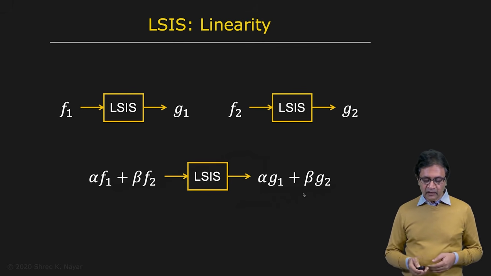

As the name implies, the first property of the system is linearity.

Suppose an input $f_1$ produces an output $g_1$, and an input $f_2$ produces an output $g_2$:

$$
f_1 \longrightarrow g_1, \qquad f_2 \longrightarrow g_2
$$

If the system is linear, then a linear combination of the inputs produces the same linear combination of the outputs:

$$
\alpha f_1 + \beta f_2 \longrightarrow \alpha g_1 + \beta g_2
$$

If this condition is satisfied, the system is linear.

## Shift Invariance

Suppose the input function is $f(x)$ and the output is $g(x)$.

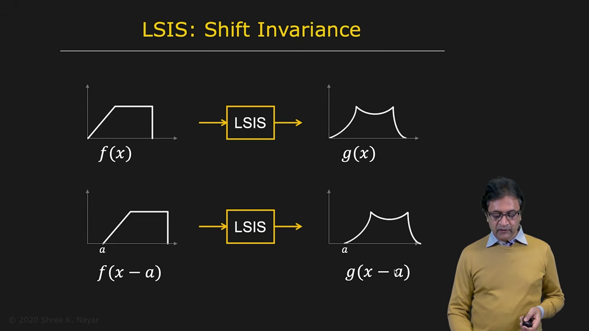

If the input is shifted by $a$, then the output should also be shifted by $a$:

$$
f(x) \longrightarrow g(x)
$$

$$
f(x-a) \longrightarrow g(x-a)
$$

If this condition is satisfied, the system is shift-invariant.

Any system that satisfies both linearity and shift invariance is a **linear shift-invariant system**.

## An Ideal Lens Is an LSIS

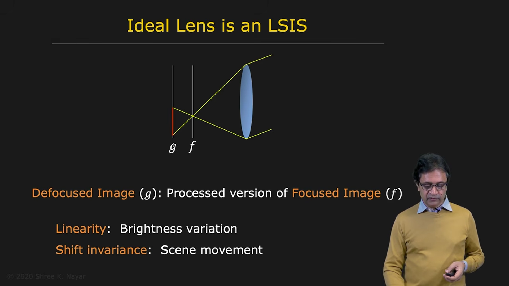

Linear shift-invariant systems are relevant to computer vision and imaging because an ideal lens system can be described this way.

An ideal lens forms a focused image on a particular plane. Call that focused image $f$. If the image plane is moved, a defocused image is formed. Call that image $g$.

For this discussion, ignore any change in magnification between $g$ and $f$ and assume there is no change in magnification.

The relationship between $f$ and $g$ is a linear shift-invariant system:

- **Linearity:** If the brightness of the scene increases, the brightness of the focused image increases linearly, and so does the brightness of the defocused image $g$.
- **Shift invariance:** If an object is shifted in the scene, its image shifts in the focused image, and its defocused image also shifts by the same amount.

This is an example of how a linear shift-invariant system can appear in an imaging system.

## Convolution

The concept of convolution is extremely important. It appears in computer vision, signal processing, and many other areas.

The convolution of two functions, $f(x)$ and $h(x)$, is denoted with an asterisk:

$$
f * h = g
$$

This is read as ``$f$ convolve with $h$''; it is not read as ``convoluted.'' Convoluted has a different meaning: complicated.

The one-dimensional convolution is defined as:

$$
g(x) = (f*h)(x) = \int_{-\infty}^{+\infty} f(\tau)h(x-\tau)\,d\tau
$$

This is the definition of convolution.

### Visual Interpretation of Convolution

| | | | | |
|--|--|--|--|--|
|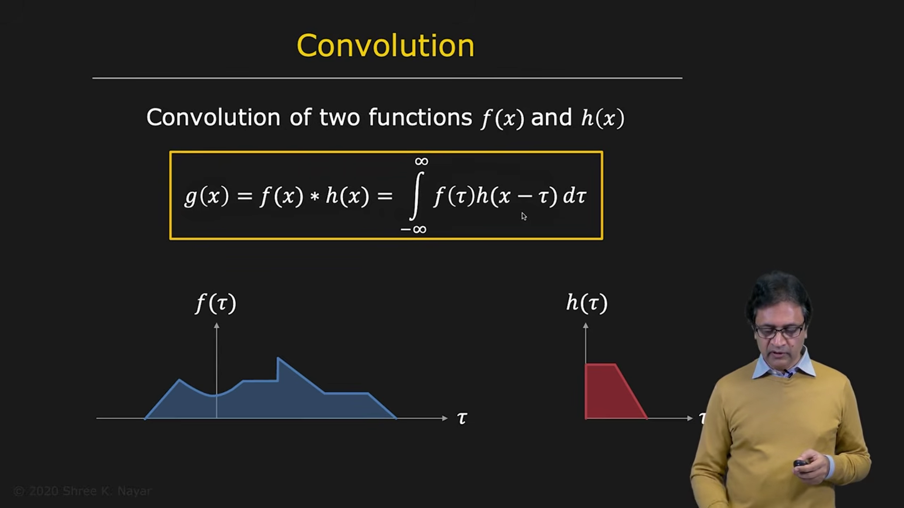 |  |  |  | |

To understand what happens in the convolution:

1. Express the functions using the variable $\tau$: $f(\tau)$ and $h(\tau)$.
2. Because of the $-\tau$ term, flip $h(\tau)$ to obtain $h(-\tau)$.
3. The term $x-\tau$ represents a shift, so shift the flipped function to $x$.
4. Overlay $h(x-\tau)$ on $f(\tau)$.
5. Take the product of the two functions.
6. Integrate the product from $-\infty$ to $+\infty$.

The result is a single number. That number is the value of the convolution at $x$, namely $g(x)$.

To find the entire function $g(x)$, take $h$, flip it, move it to $-\infty$, and slide it from left to right through $f$. At every position, calculate the product and integral. The sequence of results forms $g(x)$.

Therefore:

- Any linear shift-invariant system performs a convolution.
- Whenever convolution is being performed, the system is linear and shift-invariant.

## Convolution Examples

### Rectangle Convolved with a Rectangle

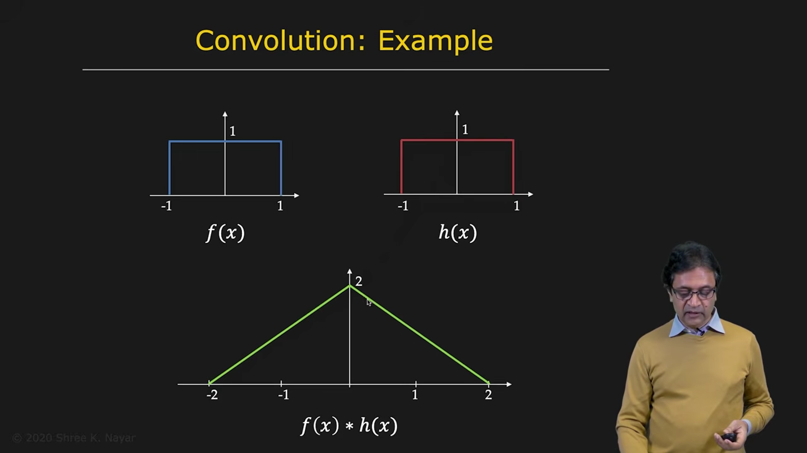

Consider a blue rectangular function and a red rectangular function. In this simple example, the rectangles are identical.

The function $h(x)$ is flipped, but because the rectangle is symmetric, it looks the same. It is then moved across $f(x)$. At each position, take the product and integrate it.

For most positions, starting from $-\infty$, the result is 0. At some point, the rectangles meet. In the example, this happens at $x=-2$.

As one rectangle slides over the other, the area of the overlapping region increases linearly with $x$. That area is the convolution value, so the result is a triangle:

- It starts at 0 at $x=-2$.
- It increases linearly.
- When the rectangles are exactly on top of each other, the product is the rectangle itself.
- The area at complete overlap is 2 because the rectangle has width 2 and height 1.
- As the rectangle slides out, the same symmetric triangular function is produced.

### Rectangle Convolved with a Triangle

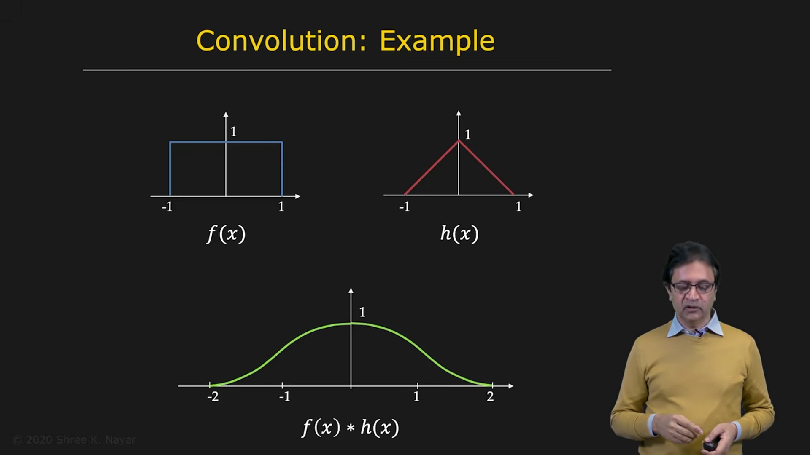

Now consider a rectangle convolved with a triangular function.

Flip the triangle, move it to $-\infty$, and slide it across the rectangle. As the triangle slides over the rectangle, the overlap region increases.

The overlap region is itself a triangle. Both its base and height increase linearly with $x$, so its area increases as the square of $x$. The resulting convolution is therefore a quadratic function, followed by the corresponding function as the triangle slides out.

These examples show how convolution can be visualized. For more complicated functions, it may not be possible to guess the result, as with most mathematical problems.

## Online Convolution Demo

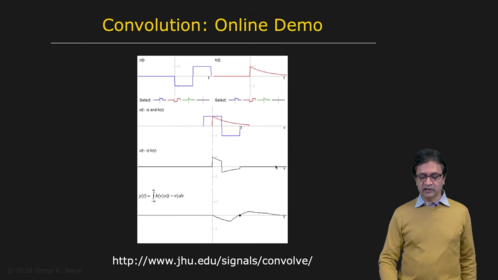

There are online demonstrations that allow you to play with functions, create new functions, and see what happens when two functions are convolved. One such demo is from Johns Hopkins and can be tried online.

## Convolution Is an LSIS

Convolution implies linear shift invariance. To show this, we need to show that performing a convolution produces a function satisfying linearity and shift invariance.

### Convolution Is Linear

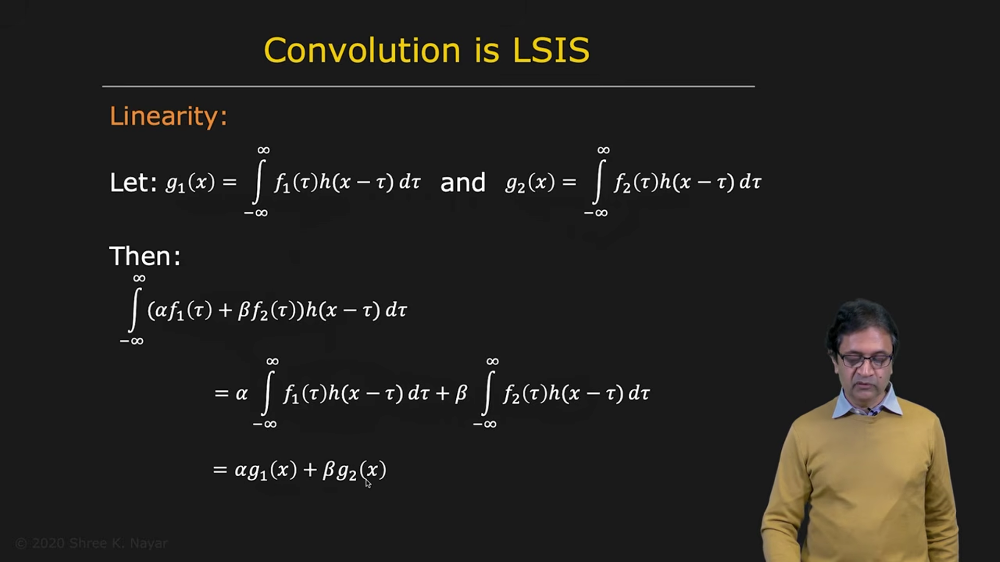

Suppose:

$$
f_1*h = g_1, \qquad f_2*h = g_2
$$

Take a linear combination of the inputs:

$$
(\alpha f_1+\beta f_2)*h
$$

Using the definition of convolution, this can be rewritten as two integrals. The constants $\alpha$ and $\beta$ can be taken outside the integrals, giving:

$$
(\alpha f_1+\beta f_2)*h
= \alpha(f_1*h)+\beta(f_2*h)
= \alpha g_1+\beta g_2
$$

This is the linearity condition, so convolution is linear.

### Convolution Is Shift-Invariant

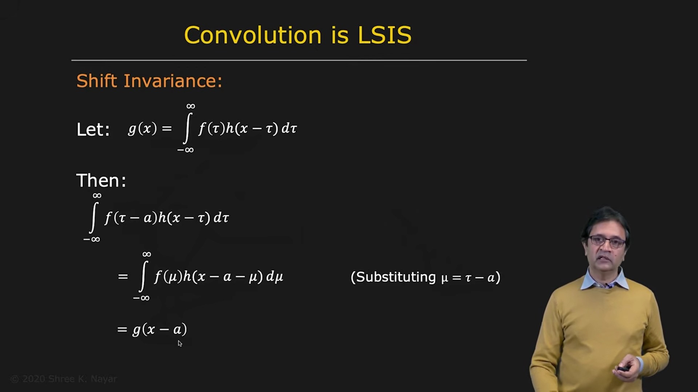

Start again with the definition:

$$
g(x) = \int_{-\infty}^{+\infty} f(\tau)h(x-\tau)\,d\tau
$$

Shift the input function by $a$, so the input becomes $f(\tau-a)$:

$$
\int_{-\infty}^{+\infty} f(\tau-a)h(x-\tau)\,d\tau
$$

Use the substitution:

$$
\mu = \tau-a
$$

The limits remain $-\infty$ to $+\infty$ because $a$ is finite. Substitution gives:

$$
\int_{-\infty}^{+\infty} f(\mu)h(x-a-\mu)\,d\mu
= g(x-a)
$$

Thus, shifting the input by $a$ shifts the output of the convolution by $a$. Therefore, convolution is shift-invariant.

Since convolution is both linear and shift-invariant, convolution is a linear shift-invariant system.

## Finding the Unknown System: The Unit Impulse Function

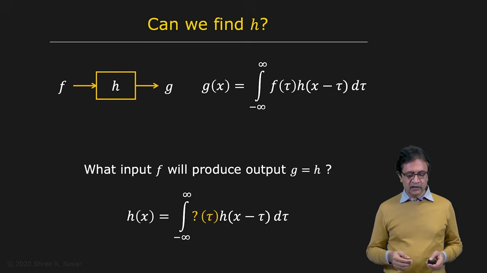

Suppose we are given a linear shift-invariant system as a black box. We know that it performs a convolution with some unknown function $h$, but we cannot open the system to inspect it. We want to find $h$.

The question is: can we apply an input so that the output is $h$? The answer is the **unit impulse function**.

### Definition of the Unit Impulse

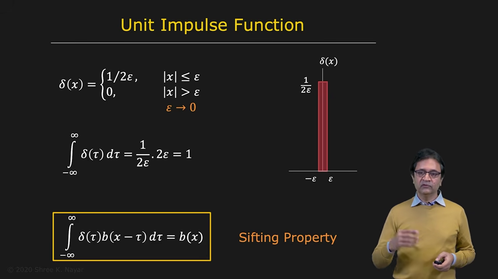

The unit impulse function is the same concept as the delta function discussed in a previous lecture. It is infinitesimally thin and infinitely tall.

For a finite approximation:

- width: $2\epsilon$,
- height: $\frac{1}{2\epsilon}$,
- area: always 1,
- $\epsilon$ tends to 0.

Thus, the impulse is very thin and very tall, with area equal to 1.

### Sifting Property

When any function $b$ is convolved with a unit impulse function, the output is $b$:

$$
b * \delta = b
$$

To visualize this, flip the impulse. It remains the same. Move it from $-\infty$ across the function, take the product at each position, and integrate. Because the delta function has infinitesimal extent but area 1, the result reads out the value of the function at that point.

This is called the **sifting property** of the unit impulse function.

### Impulse Response

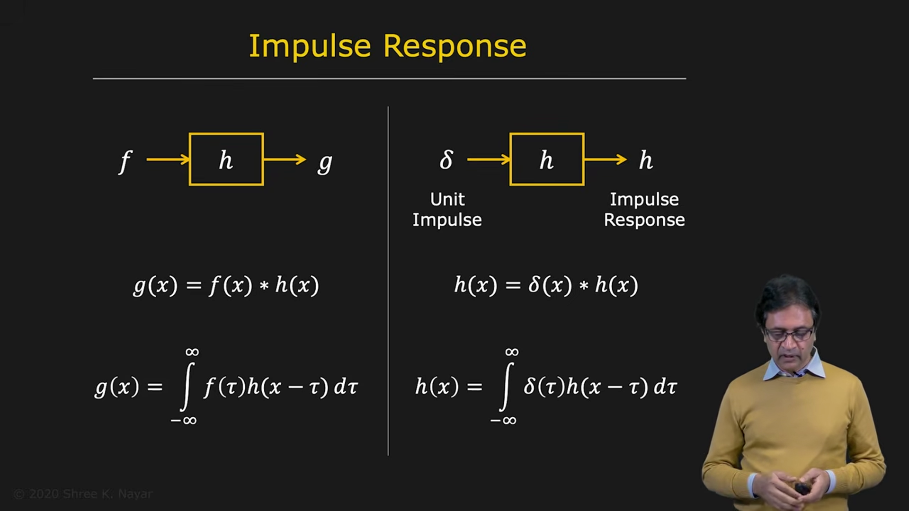

If a black-box system is linear and shift-invariant, it applies a convolution with an unknown function $h$. Apply the unit impulse as the input:

$$
\delta * h = h
$$

The output is $h$. Therefore, $h$ is called the **impulse response**, meaning the response of the system to the impulse function.

To characterize any linear shift-invariant system, hit it with a unit impulse function. Whatever comes out tells us what the system is doing in full.

## Impulse Response of the Human Eye

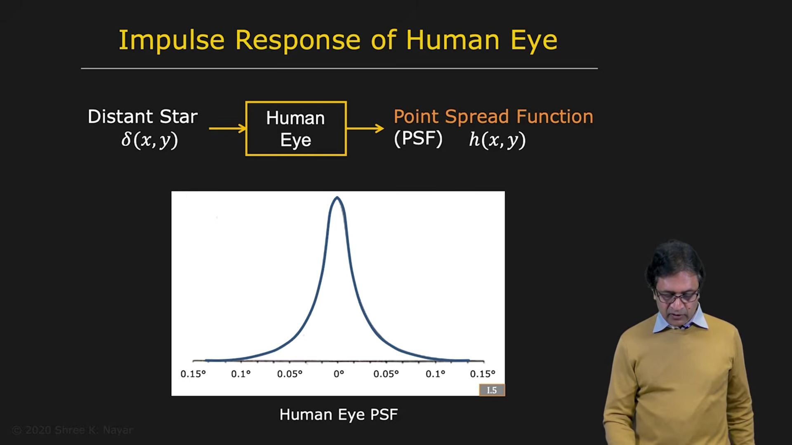

Consider the human eye as an imaging system. The eye has a lens that forms an image on the retina. We want to know the relationship between a perfect focused image in the scene and the image that lands on the retina.

Because lenses are linear and shift-invariant, we can ask for the impulse response of the human eye.

The system is two-dimensional: the scene is two-dimensional, and the retina is two-dimensional. Apply a two-dimensional impulse function $\delta(x,y)$:

$$
\delta(x,y) \longrightarrow h(x,y)
$$

The output $h(x,y)$ is the impulse response.

To stimulate the eye with an impulse function, show it a distant star. A distant star is very tiny, like a point, and very bright. The image formed on the retina is the impulse response.

For an imaging system, the impulse response is often called the **point spread function (PSF)**.

For the human eye, the measured PSF is a very narrow function. Since the retina is curved, functions on the retina are often described using angles rather than Cartesian coordinates. A slice through the two-dimensional PSF is shown in degrees.

The response has already fallen off considerably by approximately $0.05$ degrees. This helps explain why the images we see are fairly sharp. As the PSF becomes wider, the images appear blurrier and blurrier.

## Properties of Convolution

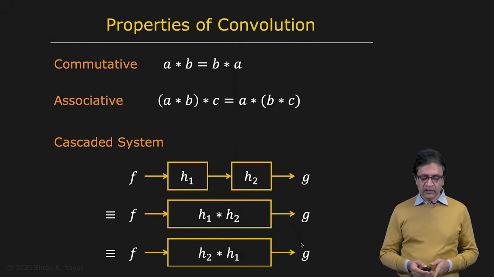

### Commutative Property

Convolution is commutative:

$$
a*b = b*a
$$

### Associative Property

Convolution is associative:

$$
(a*b)*c = a*(b*c)
$$

These properties help simplify systems that perform a series of convolutions.

### Cascaded Systems

Consider two cascaded convolution systems. The input is first convolved with $h_1$ and then with $h_2$ to produce the output.

Instead of performing two convolutions in sequence, convolve $h_1$ with $h_2$ first and create one convolution with the input:

$$
f*h_1*h_2 = f*(h_1*h_2)
$$

Because convolution is commutative, the combined filter may also be written as $h_2*h_1$.

## Two-Dimensional Convolution

The concept of convolution was first described using one-dimensional signals. Images are two-dimensional, so the input is a two-dimensional function $f(x,y)$, and the impulse response is also a two-dimensional function.

The output is another two-dimensional image. The two-dimensional convolution is:

$$
g(x,y) = \int_{-\infty}^{+\infty}\int_{-\infty}^{+\infty}
f(\tau,\mu)h(x-\tau,y-\mu)\,d\tau\,d\mu
$$

The definition extends easily to higher dimensions. For example, medical imaging may involve volumetric data such as ultrasound images. Operations can be applied to three-dimensional data, and convolution can be extended to three or more dimensions.
