# Linear Filters and Convolution with Discrete Images

Now that we understand linear shift-invariant systems and convolution, we can develop simple linear filters.

These filters can be implemented using convolution to:

* enhance an image
* reduce noise
* smooth an image 
* extract useful information

Before studying specific filters, we first examine how convolution works with discrete images.

---

## 1. Convolution with Discrete Images

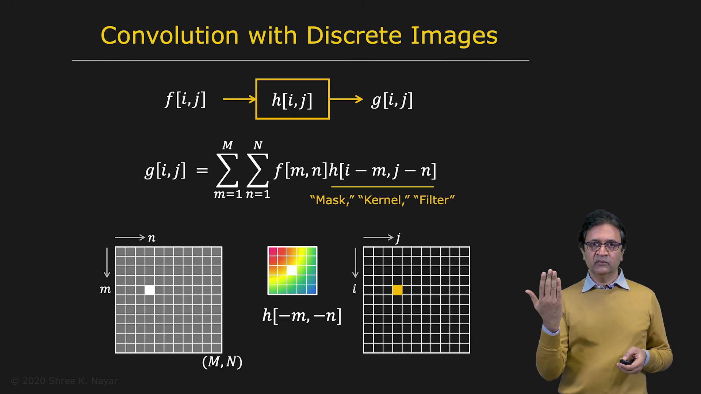

Let the input image be represented by:

$$
f[i,j]
$$

Here:

* $i$ represents the row number
* $j$ represents the column number
* $(i,j)$ identifies the location of a pixel
* $f[i,j]$ is the intensity value at that pixel

Let the impulse response, or convolution mask, be:

$$
h[i,j]
$$

The output image is:

$$
g[i,j]
$$

For a discrete two-dimensional image, convolution is defined as:

$$
g[i,j]
=
\sum_{m}\sum_{n}
f[m,n]\,h[i-m,j-n]
$$

The indices $m$ and $n$ identify the pixels in the input image.

The terms $i-m$ and $j-n$ represent the two-dimensional flip that occurs during convolution:

* $i-m$ flips the filter with respect to the row direction
* $j-n$ flips the filter with respect to the column direction

The impulse response $h[i,j]$ is also called:

* a convolution mask
* a convolution kernel
* a convolution filter

These terms are often used interchangeably.

---

## 2. How Discrete Convolution Works

To compute the output value at a particular location $(i,j)$:

1. Start with the convolution mask $h[i,j]$.
2. Flip it with respect to the row direction.
3. Flip it with respect to the column direction.
4. Place the center of the flipped mask at pixel $(i,j)$.
5. Multiply corresponding image and mask values.
6. Add all the products.
7. Store the result at $g[i,j]$.

Mathematically:

$$
g[i,j]
=
\sum_{m}\sum_{n}
f[m,n]\,h[i-m,j-n]
$$

To compute the entire output image, repeat this process for every pixel. The mask is moved across the image in a raster-scan order, from left to right and from top to bottom.

---

## 3. The Border Problem

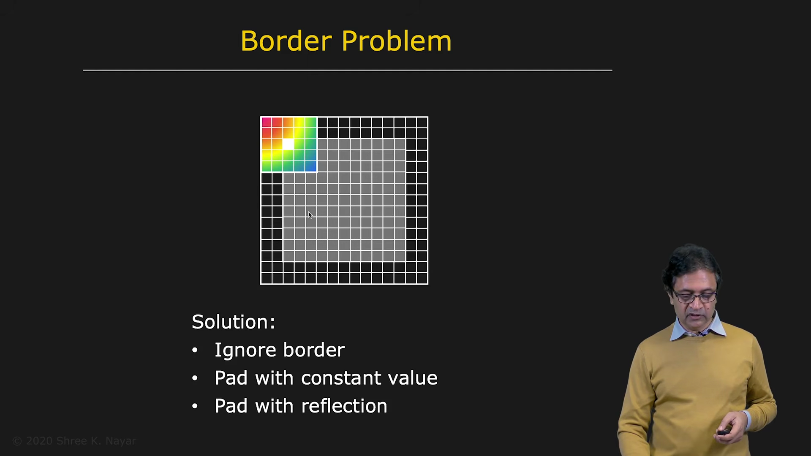

When the mask is placed near the border of an image, part of the mask extends outside the available image area.

The image does not contain any pixel values outside its boundary, so a decision must be made about how to handle these locations.

There are three common approaches.

### 3.1 Ignore the Border

Apply the filter only where the entire mask fits inside the image.

This avoids inventing values outside the image, but the output becomes smaller or border pixels remain undefined.

The disadvantage is that information near the boundary is lost.

---

### 3.2 Constant Padding

Add extra rows and columns around the image and assign them a constant value.

For example, the padding value may be:

* zero
* the average brightness of the image
* another chosen constant

The filter can then be applied to the padded image.

---

### 3.3 Reflection Padding

Reflect the image content across its boundary.

For example, the pixels near the left edge are reflected to create artificial pixels outside the left edge. The same process is applied to the other sides of the image.

Reflection padding often gives more natural results than constant padding.

However, all padding methods are approximations because the actual image content outside the boundary is unknown.

---

## 4. Example: The Impulse Filter

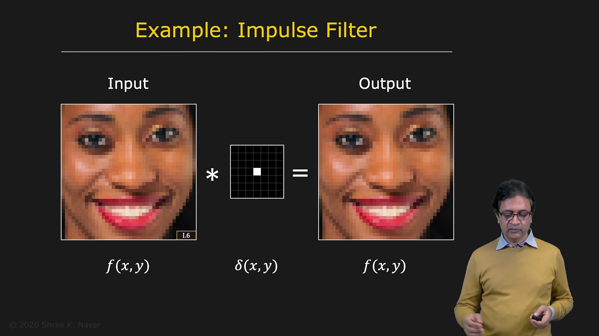

Consider an image $f[i,j]$ convolved with the two-dimensional impulse function:

$$
\delta[i,j]
$$

The impulse function is unchanged when it is flipped. Using the sifting property:

$$
f * \delta = f
$$

Therefore:

$$
g[i,j] = f[i,j]
$$

The output is exactly the same as the input.

The impulse filter is therefore an identity filter.

---

## 5. Example: Image Shifting

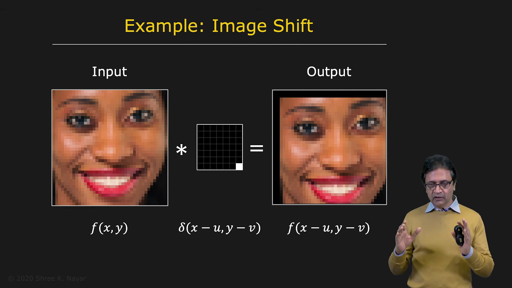

Now consider an impulse function that is moved away from the origin, for example, toward the bottom-right corner of the mask.

At first, it may appear that the image will shift in the opposite direction because the filter reads values from another location.

However, convolution includes a flip. After the mask is flipped in both dimensions, the impulse moves to the opposite position.

As a result, the output image is shifted down and to the right.

This example shows why the flipping operation in convolution is important.

---

## 6. Example: Averaging with a Box Filter

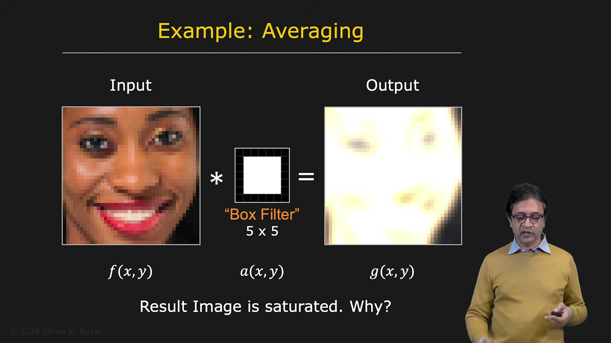

Consider a square mask with constant value 1 everywhere. For example, a $5 \times 5$ mask:

$$
h[m,n] = 1
$$

for all values of $m$ and $n$ inside the mask.

This is called a box filter.

At each pixel, the filter adds the values of the surrounding $5 \times 5$ neighborhood. The result is a smoothed image because local variations are averaged together.

However, if every mask value is 1, the output becomes much brighter than the input.

A $5 \times 5$ mask contains 25 values, so the output may be approximately 25 times brighter in uniform regions. For an 8-bit image, values may exceed the valid range:

$$
0 \leq g[i,j] \leq 255
$$

Values above 255 are clipped or saturated, which produces an undesirable result.

---

## 7. Normalized Box Filter

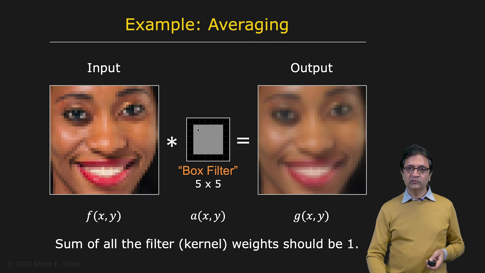

To preserve the average brightness, divide every mask value by the area of the mask.

For a $5 \times 5$ box filter:

$$
h[m,n] = \frac{1}{25}
$$

The mask becomes:

$$
h =
\frac{1}{25}
\begin{bmatrix}
1 & 1 & 1 & 1 & 1 \\
1 & 1 & 1 & 1 & 1 \\
1 & 1 & 1 & 1 & 1 \\
1 & 1 & 1 & 1 & 1 \\
1 & 1 & 1 & 1 & 1
\end{bmatrix}
$$

The sum of all mask values is 1:

$$
\sum_m\sum_n h[m,n] = 1
$$

This keeps the average image brightness approximately unchanged while still smoothing the image.

---

## 8. Limitations of a Box Filter

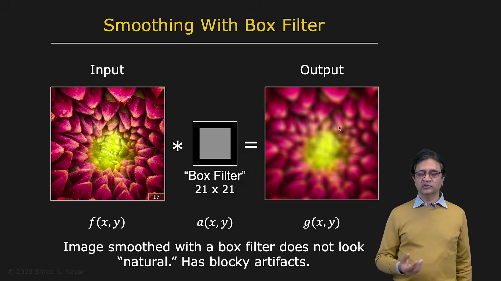

A larger normalized box filter produces stronger smoothing. For example, a $21 \times 21$ box filter can remove more fine-scale variations.

However, box filters may introduce blocky artifacts. These artifacts often align with the horizontal and vertical directions of the image.

The reason is that every pixel inside the square mask receives the same weight, regardless of its distance from the center.

To avoid this problem, we can use a filter whose weights decrease smoothly away from the center.

---

## 9. Fuzzy Filters

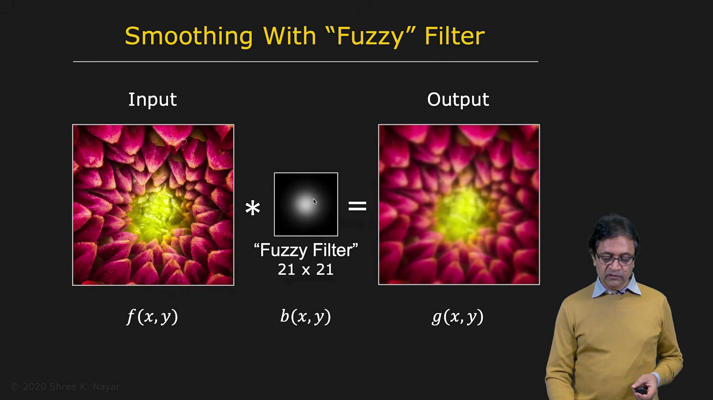

A fuzzy filter assigns the largest weight to the center pixel and gradually decreases the weight with distance.

A good fuzzy filter should be:

* largest at the center
* smoothly decreasing away from the center
* rotationally symmetric
* normalized so that its weights sum to 1

This produces smoother and more natural results than a box filter.

---

## 10. Gaussian Filter

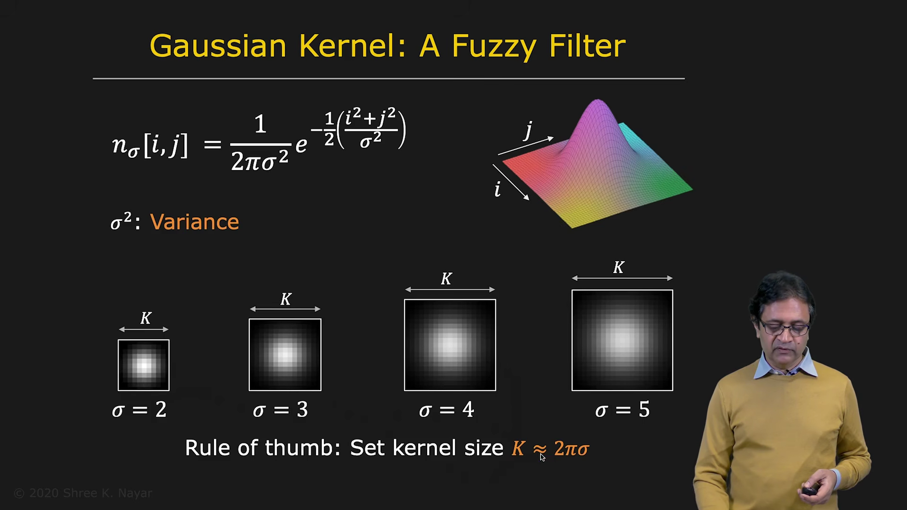

The Gaussian function is commonly used to construct a fuzzy filter.

The two-dimensional Gaussian function is:

$$
G_\sigma(i,j)
=
\frac{1}{2\pi\sigma^2}
\exp\left(
-\frac{i^2+j^2}{2\sigma^2}
\right)
$$

where:

* $i$ and $j$ are the row and column coordinates
* $\sigma$ is the standard deviation
* $\sigma^2$ is the variance

A larger $\sigma$ produces a wider Gaussian and stronger smoothing.

The normalization factor is important:

$$
\frac{1}{2\pi\sigma^2}
$$

It ensures that the total area under the Gaussian remains equal to 1, regardless of the value of $\sigma$.

In a discrete implementation, the Gaussian is sampled on a finite mask and then normalized so that the sum of all mask values is 1.

---

## 11. Choosing the Gaussian Mask Size

The Gaussian function never reaches exactly zero. It approaches zero only as the distance approaches infinity.

An infinite mask cannot be used computationally, so a finite approximation is required.

A common rule of thumb is:

$$
k \approx 2\pi\sigma
$$

where $k$ is the width and height of the square mask.

The mask should generally have an odd size, such as:

* $3 \times 3$
* $5 \times 5$
* $7 \times 7$
* $ nine \times nine$

A larger mask captures more of the Gaussian's energy and provides a better approximation.

---

## 12. Gaussian Smoothing

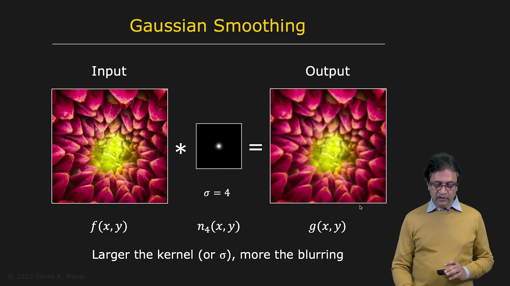

Consider an image $f[i,j]$ convolved with Gaussian filters of different standard deviations.

| | | |
|--|--|--|
| | 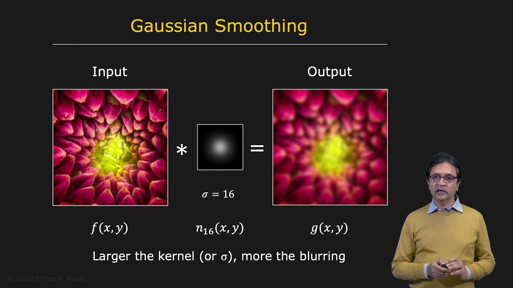 |  |

For a small value such as:

$$
\sigma = 4
$$

the image receives mild smoothing.

For a larger value such as:

$$
\sigma = 8
$$

the image becomes more blurred.

For an even larger value such as:

$$
\sigma = 16
$$

the smoothing becomes stronger.

Unlike a box filter, Gaussian smoothing does not usually introduce blocky artifacts. The image becomes progressively smoother as $\sigma$ increases.

---

## 13. Gaussian Smoothing Is Separable

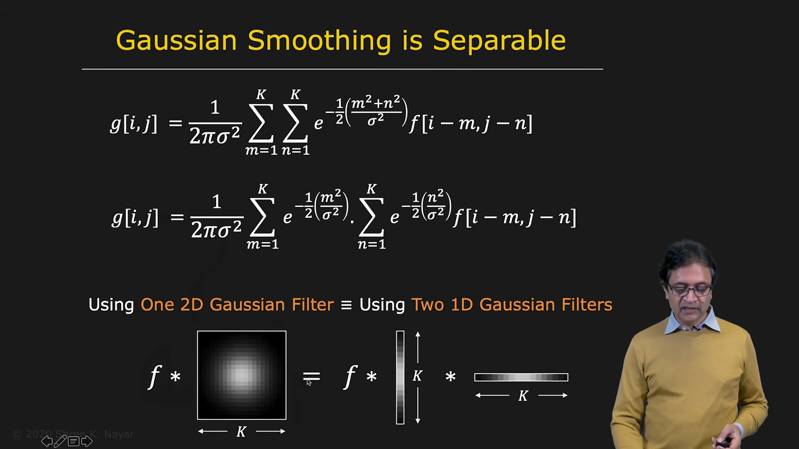

One important property of the Gaussian filter is that it is separable.

Starting with the two-dimensional Gaussian:

$$
G_\sigma(m,n)
=
\frac{1}{2\pi\sigma^2}
\exp\left(
-\frac{m^2+n^2}{2\sigma^2}
\right)
$$

The exponent can be separated:

$$
\exp\left(
-\frac{m^2+n^2}{2\sigma^2}
\right)
=
\exp\left(
-\frac{m^2}{2\sigma^2}
\right)
\exp\left(
-\frac{n^2}{2\sigma^2}
\right)
$$

Therefore, the two-dimensional Gaussian can be written as the product of two one-dimensional Gaussians:

$$
G_\sigma(m,n)
=
G_\sigma(m)\,G_\sigma(n)
$$

Consequently:

$$
f * G_\sigma^{2D}
=
\left(f * G_\sigma^{vertical}\right)
*
G_\sigma^{horizontal}
$$

In practice:

1. Convolve the image with a one-dimensional vertical Gaussian.
2. Convolve the result with a one-dimensional horizontal Gaussian.

This produces exactly the same result as convolving the image directly with the two-dimensional Gaussian.

---

## 14. Computational Advantage of Separability

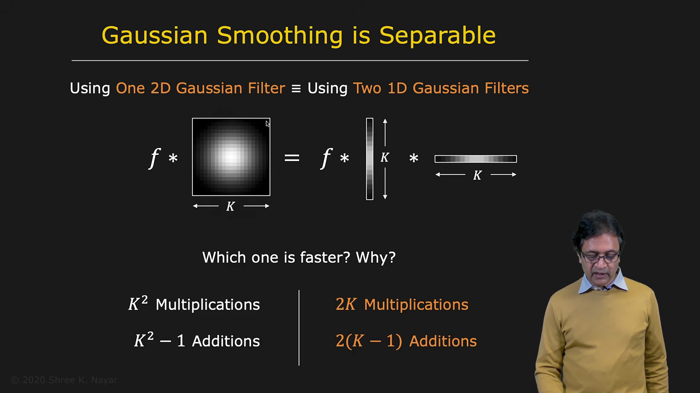

For a $k \times k$ two-dimensional filter, computing one output pixel requires:

* $k^2$ multiplications
* $k^2 - 1$ additions

For two one-dimensional filters, each of length $k$, the computation requires:

* $2k$ multiplications
* $2k - 1$ additions

For large values of $k$:

$$
2k \ll k^2
$$

Therefore, separable filters are much more efficient.

Whenever a filter is separable, especially when it has a large support region, separability should be used to reduce computational cost.

---

## 15. Summary

Discrete convolution applies a mask to an image by:

1. flipping the mask in both dimensions
2. placing it over a neighborhood
3. multiplying corresponding values
4. summing the products
5. storing the result at the center pixel

Important filters include:

* the impulse filter, which leaves the image unchanged
* the shifted impulse, which shifts the image
* the box filter, which averages neighboring pixels
* the Gaussian filter, which provides smooth and natural blurring

The Gaussian filter is especially useful because it:

* reduces noise
* avoids blocky artifacts
* is normalized
* is separable
* can be implemented efficiently

These linear filters form the foundation for many image-processing operations.