# Nonlinear Filters

We have seen how convolution and linear filters can be used to smooth images and reduce noise.

However, many problems cannot be solved effectively using linear filters. In such cases, we need nonlinear filters that cannot be implemented as convolutions.

---
 
## 1. Smoothing to Remove Image Noise

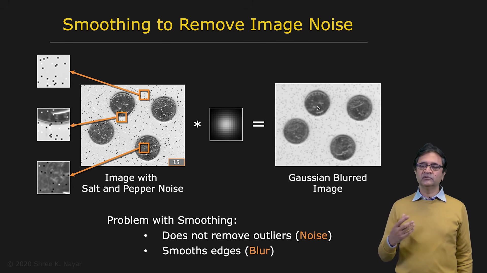

Consider an image containing salt-and-pepper noise.

This noise appears as scattered bright and dark pixels:

* bright pixels are called salt noise
* dark pixels are called pepper noise

The goal is to remove this noise while preserving the important information in the image, such as the shapes and details of the coins.

---

## 2. Why Gaussian Smoothing Is Not Enough

If a Gaussian filter is applied to an image with salt-and-pepper noise, the noise is reduced slightly.

However, the Gaussian filter does not actually remove the outliers. Instead, it spreads or smears their intensity into neighboring pixels.

At the same time, the filter blurs important image details, especially object boundaries and edges.

Therefore, Gaussian smoothing has two disadvantages in this situation:

* it does not effectively remove extreme outliers
* it blurs the edges and details of the image

To address this problem, we use median filtering.

---

## 3. Median Filtering

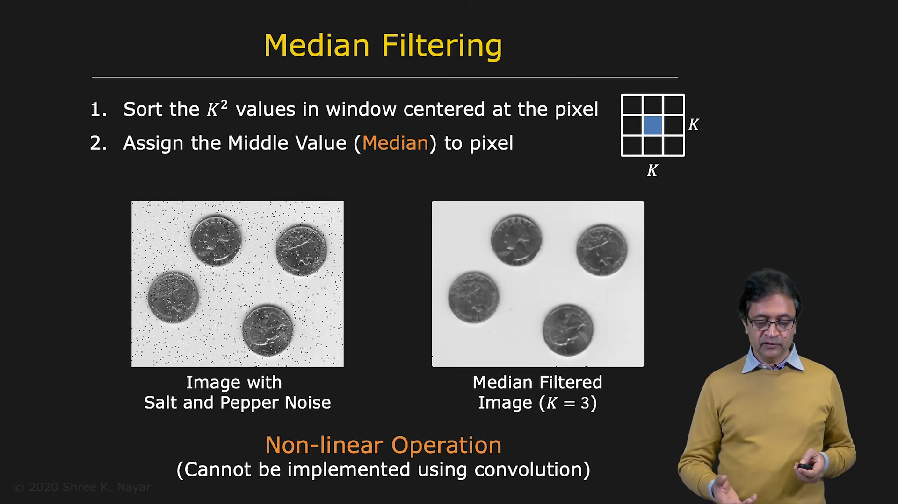

Median filtering is an algorithmic nonlinear operation.

To calculate the output value at a pixel:

1. Select a neighborhood around the pixel, such as a $K \times K$ window.
2. Collect all $K^2$ intensity values in that neighborhood.
3. Sort the intensity values.
4. Select the middle value.
5. Assign the middle value to the output pixel.

The selected value is the median of the neighborhood.

For example, consider a $3 \times 3$ neighborhood:

$$
\begin{bmatrix}
10 & 11 & 12 \\
10 & 255 & 11 \\
9 & 10 & 12
\end{bmatrix}
$$

After sorting:

$$
9,\ 10,\ 10,\ 10,\ 11,\ 11,\ 12,\ 12,\ 255
$$

The median is:

$$
11
$$

The extreme value 255 is ignored because it is an outlier.

The median-filtered output is therefore 11.

---

## 4. Median Filtering and Salt-and-Pepper Noise

A small median filter, such as a $3 \times 3$ filter, can remove most salt-and-pepper noise.

The result is often impressive:

* most of the noise disappears
* object boundaries are largely preserved
* only a small amount of detail is lost

However, median filtering cannot be implemented using convolution. Convolution computes a weighted sum, whereas median filtering requires sorting the values in a neighborhood.

Therefore, median filtering is a nonlinear filter.

---

## 5. Limitations of Median Filtering

| | |
|--|--|
|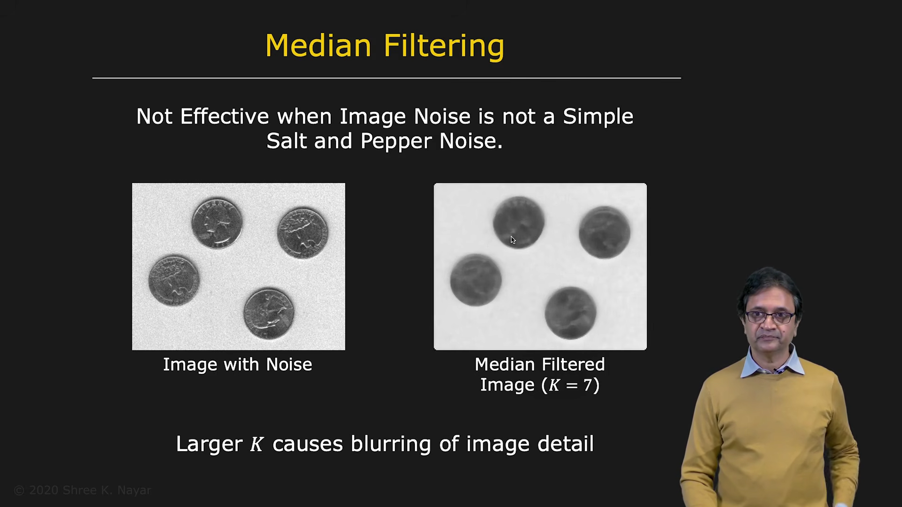 | 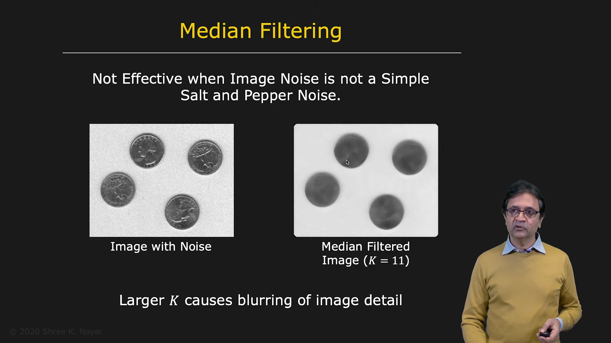 |

Median filtering is not a magical solution.

Consider an image with more realistic noise, where almost every pixel contains a different amount of noise. This type of noise often appears in images captured under low-light conditions.

A larger median filter may be required to reduce this type of noise.

Although a larger filter reduces the noise more effectively, it also removes image details.

As the filter size increases:

* noise is reduced
* texture may be removed
* object details become less visible
* different objects may become difficult to distinguish

Thus, a small filter may leave some noise, while a large filter may destroy important information.

---

## 6. Revisiting Gaussian Smoothing

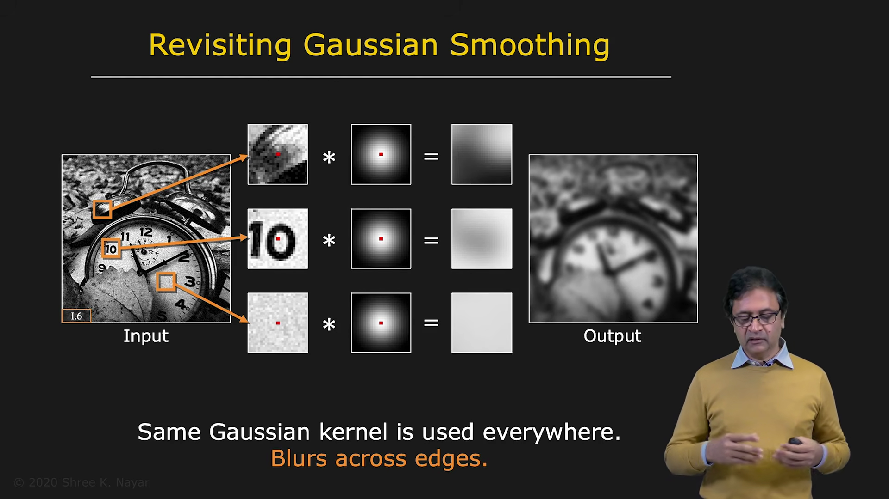

Consider a grainy image containing noise.

If Gaussian smoothing is applied:

* a flat region may become very smooth
* detailed regions may become blurred
* digits and other fine structures may be washed out

The problem is that the same Gaussian filter is applied at every pixel, regardless of the local image structure.

The filter does not know whether it is operating in:

* a flat region
* a textured region
* an object boundary
* a region containing important detail

A better filter should adapt to the local content of the image.

---

## 7. Blurring Similar Pixels Only

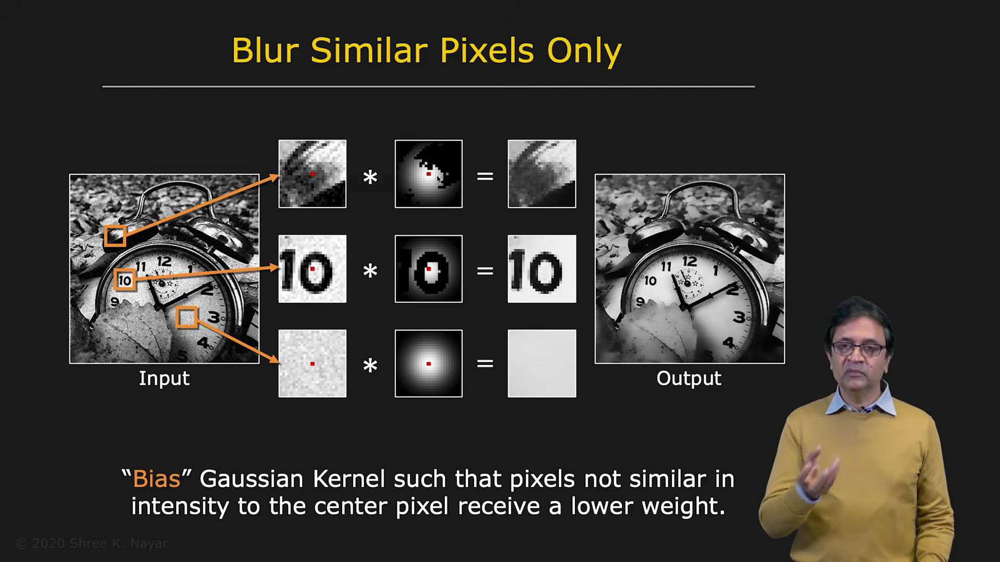

Suppose we want to continue using Gaussian smoothing, but only for pixels whose intensities are similar to the center pixel.

For example, if the center pixel has intensity 100 and a neighboring pixel has intensity 200, the difference is large. We may decide that the neighboring pixel should not influence the output.

Pixels with similar intensity values receive higher weights, while pixels with very different intensity values receive lower weights or are ignored.

The Gaussian weights must still be normalized:

$$
\sum_{m}\sum_{n} w[m,n] = 1
$$

This ensures that the average brightness of the image does not change.

In a flat region, most neighboring pixels have similar intensities, so most of the Gaussian kernel is used.

Near an edge, pixels on the other side of the edge have very different intensities, so their influence is reduced.

This simple idea leads to the bilateral filter.

---

## 8. Bilateral Filter

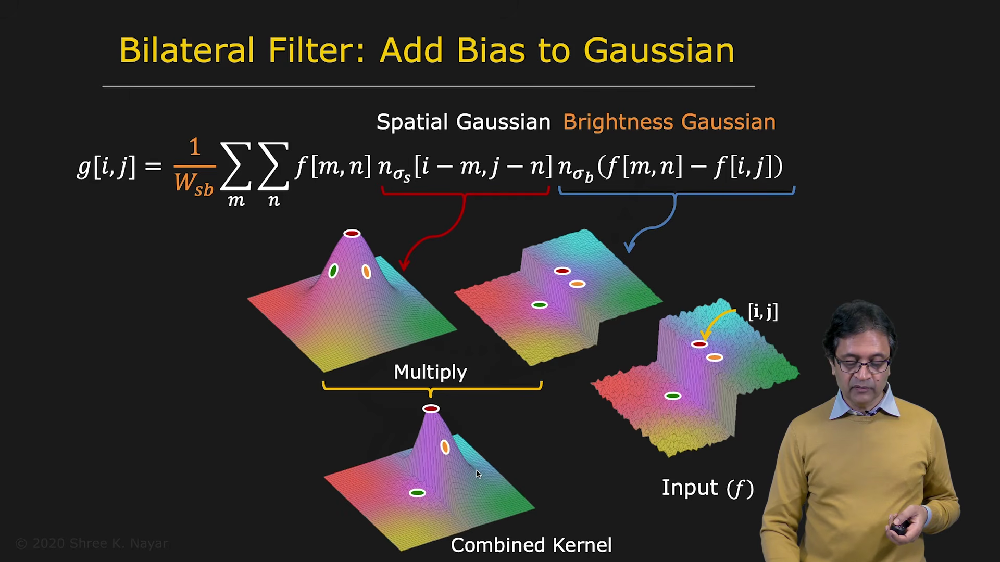

The bilateral filter combines two types of weighting:

1. spatial weighting
2. brightness or intensity weighting

The spatial weighting gives greater importance to pixels that are close to the center pixel.

The brightness weighting gives greater importance to pixels whose intensities are similar to the center pixel.

For an image $f[i,j]$, the bilateral filter is:

$$
g[i,j]
=
\frac{1}{W[i,j]}
\sum_{m}\sum_{n}
G_{\sigma_s}(i-m,j-n)
G_{\sigma_r}\big(f[i,j]-f[m,n]\big)
f[m,n]
$$

where the normalization factor is:

$$
W[i,j]
=
\sum_{m}\sum_{n}
G_{\sigma_s}(i-m,j-n)
G_{\sigma_r}\big(f[i,j]-f[m,n]\big)
$$

The two Gaussian functions have different roles.

### Spatial Gaussian

The spatial Gaussian is:

$$
G_{\sigma_s}(i-m,j-n)
=
\exp\left(
-\frac{(i-m)^2+(j-n)^2}
{2\sigma_s^2}
\right)
$$

It gives large weights to nearby pixels and small weights to distant pixels.

### Brightness Gaussian

The brightness Gaussian is:

$$
G_{\sigma_r}\big(f[i,j]-f[m,n]\big)
=
\exp\left(
-\frac{(f[i,j]-f[m,n])^2}
{2\sigma_r^2}
\right)
$$

It gives large weights to pixels with similar intensity and small weights to pixels with very different intensity.

Here:

* $\sigma_s$ controls the spatial neighborhood
* $\sigma_r$ controls sensitivity to intensity differences

---

## 9. How Bilateral Filtering Preserves Edges

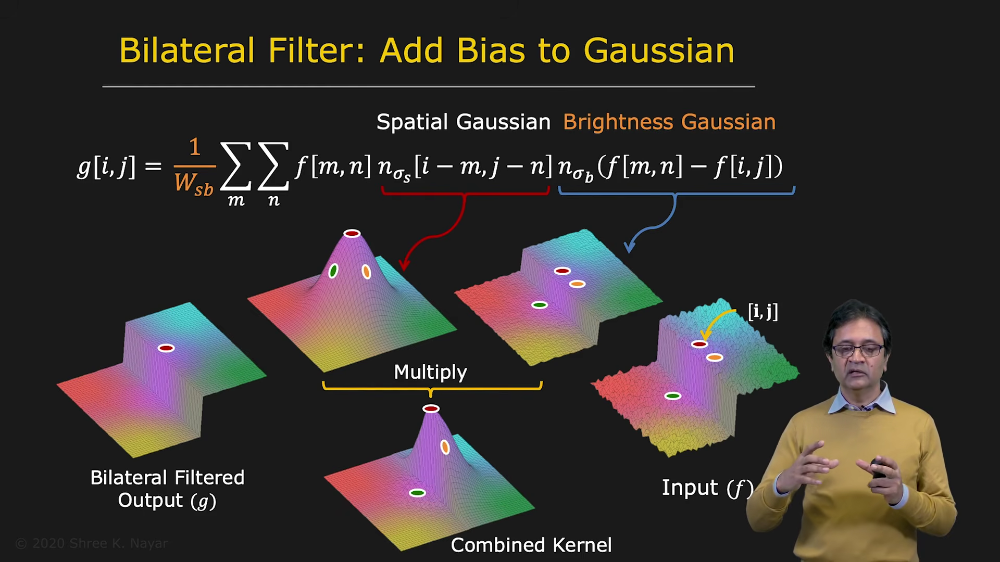

Consider a noisy image containing a sharp edge.

A spatial Gaussian gives similar weights to nearby pixels on both sides of the edge. Therefore, ordinary Gaussian smoothing averages across the edge and blurs it.

The bilateral filter behaves differently.

Pixels on the same side of the edge:

* are spatially close
* have similar intensity
* receive large weights

Pixels on the opposite side of the edge:

* may be spatially close
* have very different intensity
* receive small weights

Therefore, the filter smooths noise within each region while reducing smoothing across the boundary.

The filter adapts to the image content and preserves the edge.

---

## 10. Bilateral Filtering Is Nonlinear

The filter changes according to the intensity of the center pixel and its neighborhood.

Therefore, the mask is different at different image locations.

Since convolution requires the same fixed mask to be shifted across the image, a bilateral filter cannot be implemented as a convolution.

The bilateral filter is therefore nonlinear and spatially varying.

Its main advantage is that it can:

* reduce noise
* smooth relatively uniform regions
* preserve important edges
* adapt to local image structure

---

## 11. Normalization in Bilateral Filtering

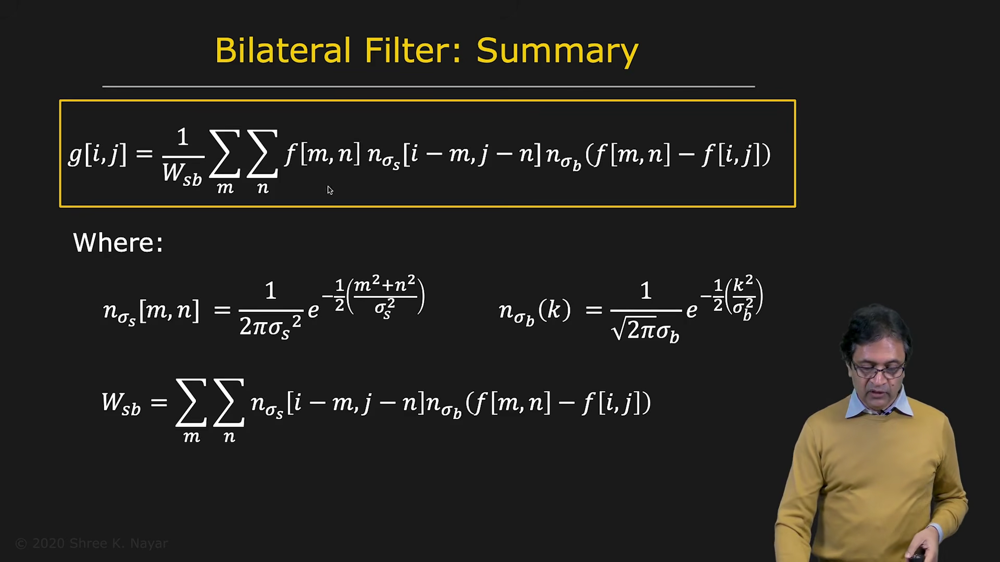

The shape of the bilateral filter changes from pixel to pixel.

To preserve image brightness, the weights must be normalized.

The normalization factor is the sum of all combined spatial and brightness weights:

$$
W[i,j]
=
\sum_{m}\sum_{n}
G_{\sigma_s}(i-m,j-n)
G_{\sigma_r}\big(f[i,j]-f[m,n]\big)
$$

The output is then:

$$
g[i,j]
=
\frac{
\sum_{m}\sum_{n}
w[i,j,m,n]f[m,n]
}{
\sum_{m}\sum_{n}
w[i,j,m,n]
}
$$

where:

$$
w[i,j,m,n]
=
G_{\sigma_s}(i-m,j-n)
G_{\sigma_r}\big(f[i,j]-f[m,n]\big)
$$

Normalization ensures that the total weight is effectively 1.

---

## 12. Gaussian Filtering Compared with Bilateral Filtering

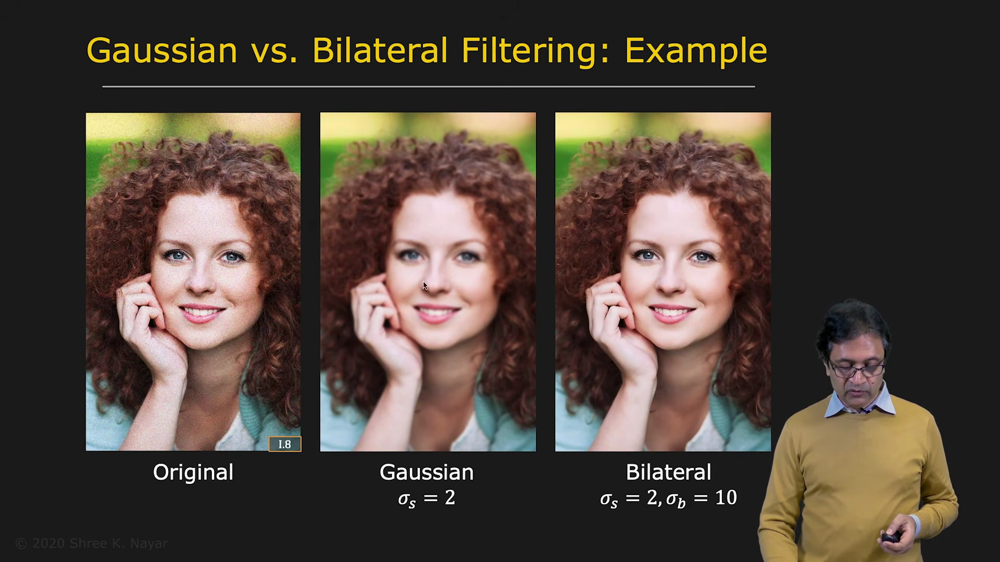

Consider an image containing noise.

Using Gaussian filtering with:

$$
\sigma = 2
$$

produces a slightly blurred image. Some noise remains, and fine details are reduced.

Now use a bilateral filter with:

* spatial standard deviation $\sigma_s = 2$
* brightness standard deviation $\sigma_r = 10$

The bilateral filter can remove much more noise while preserving important image features.

Details around the eyes and mouth, for example, remain clearer than they would with ordinary Gaussian smoothing.

---

## 13. Effect of the Spatial Standard Deviation
| | |
|--|--|
|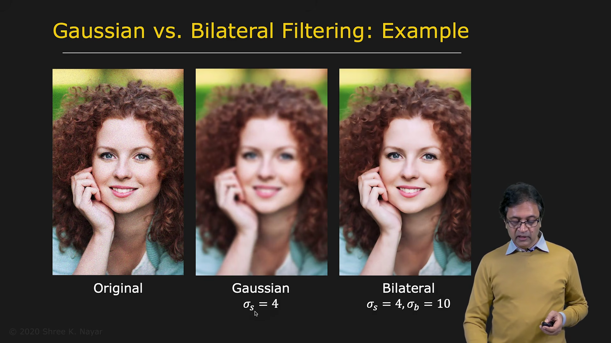 | 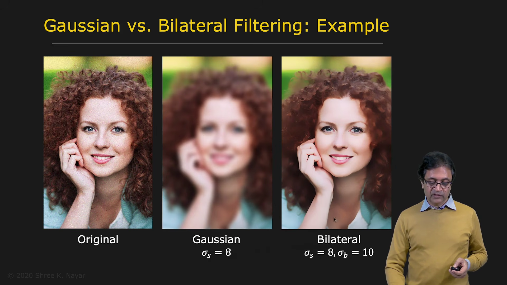 |

Increasing $\sigma_s$ increases the spatial range of the filter.

For Gaussian smoothing, a larger spatial standard deviation produces a much blurrier image.

For bilateral filtering, the result is more controlled because the brightness term prevents smoothing across strong intensity changes.

However, as $\sigma_s$ becomes larger:

* more distant pixels are considered
* more image information is averaged
* some fine details are removed
* the image may begin to look painterly

At sufficiently large values, shaded regions may become flatter, producing a watercolor-like appearance.

---

## 14. Effect of the Brightness Standard Deviation

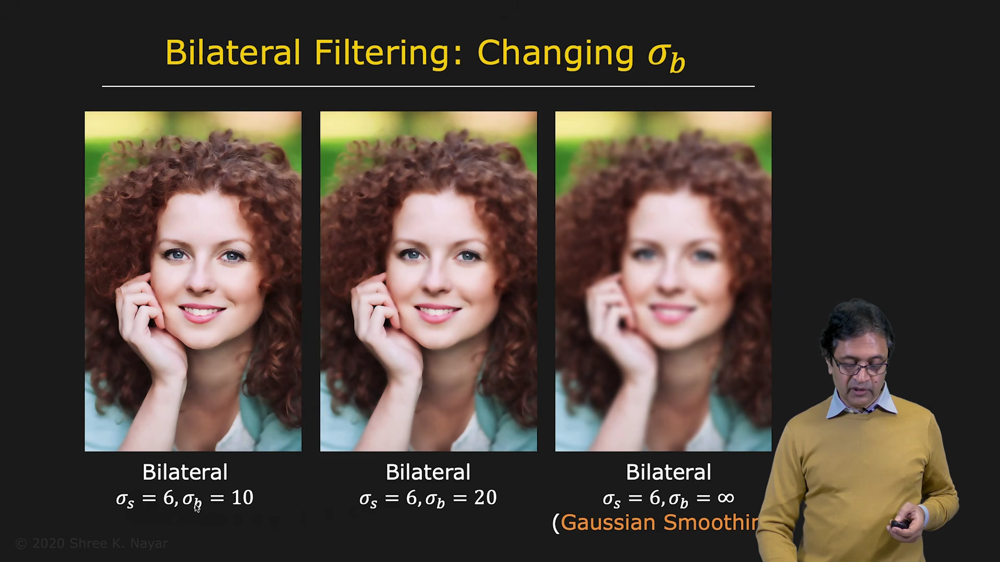

The value of $\sigma_r$ controls how strongly the filter reacts to intensity differences.

A small $\sigma_r$ strongly separates pixels with different brightness values. This preserves edges more aggressively.

A larger $\sigma_r$ allows pixels with greater intensity differences to influence one another. The output becomes smoother but may lose more edge information.

If $\sigma_r$ becomes very large:

$$
\sigma_r \rightarrow \infty
$$

then the brightness Gaussian becomes approximately constant:

$$
G_{\sigma_r}\big(f[i,j]-f[m,n]\big) \approx 1
$$

for all relevant intensity differences.

The bilateral filter then becomes an ordinary spatial Gaussian filter.

This is expected because the intensity-based weighting no longer has any significant effect.

---

## 15. Summary

Linear filters use a fixed mask and can be implemented using convolution. They are useful for general smoothing, but they often blur edges.

Nonlinear filters adapt to the image content.

Median filtering:

* replaces each pixel with the median of its neighborhood
* is effective for salt-and-pepper noise
* cannot be implemented using convolution
* may remove important details when the window is large

Bilateral filtering:

* combines spatial and intensity-based Gaussian weights
* smooths pixels with similar intensities
* reduces smoothing across strong edges
* preserves important boundaries
* is nonlinear and spatially varying
* requires normalization at every pixel

The bilateral filter combines some advantages of Gaussian smoothing and median filtering. It provides effective noise reduction while preserving much of the structure and detail in the image.