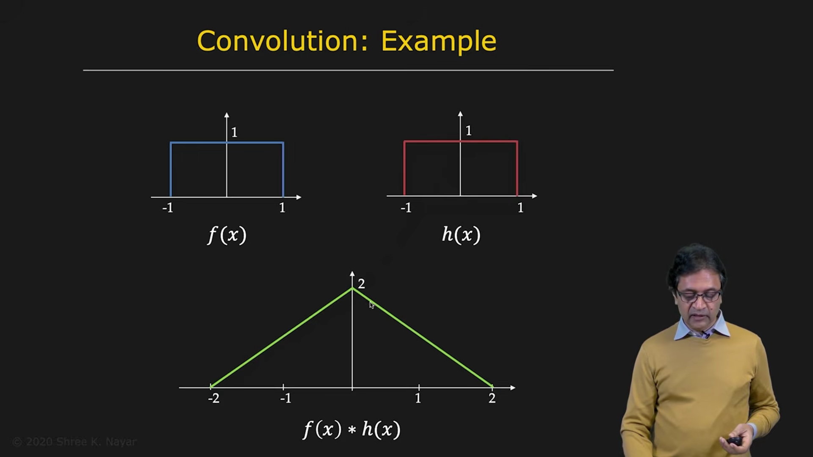

# Convolution and the Fourier Transform

Convolution is a fundamental operation in image processing. It is closely related to the Fourier transform, and this relationship provides both a mathematical understanding of filtering and an efficient way to compute convolutions.

---

## 1. Reviewing Convolution

The convolution of two functions $f$ and $h$ produces a new function $g$:

$$
g=f*h
$$

For one-dimensional continuous functions:

$$
g(x)=(f*h)(x)=\int_{-\infty}^{+\infty}f(\tau)h(x-\tau)\,d\tau
$$

To compute the value at a particular position $x$:

1. Express the functions using the variable $\tau$.
2. Flip $h(\tau)$ to obtain $h(-\tau)$.
3. Shift the flipped function to position $x$, producing $h(x-\tau)$.
4. Multiply $f(\tau)$ and $h(x-\tau)$.
5. Integrate the product over all $\tau$.

The result is the value $g(x)$. To obtain the complete function $g$, slide the flipped function across $f$ and repeat this calculation.

---

## 2. Example: Rectangle Convolved with a Rectangle

Consider two identical rectangular functions. Because a rectangle is symmetric, flipping it does not change its appearance.

As one rectangle slides across the other, the area of their overlap changes:

* before the rectangles meet, the overlap is zero
* as they begin to overlap, the overlap area increases linearly
* at complete overlap, the area is largest
* as the second rectangle moves away, the overlap decreases linearly

The convolution is therefore a triangular function.

This example shows that convolution can often be understood geometrically as the area of overlap between two functions.

---

## 3. The Convolution Theorem

Let:

$$
g=f*h
$$

Taking the Fourier transform of both sides gives:

$$
G(u)=F(u)H(u)
$$

where $F$, $G$, and $H$ are the Fourier transforms of $f$, $g$, and $h$.

This is called the **convolution theorem**:

> Convolution in the spatial domain is equivalent to multiplication in the frequency domain.

There is a corresponding product theorem:

> Multiplication in the spatial domain is equivalent to convolution in the frequency domain.

In notation:

$$
\mathcal{F}\{f*h\}=F\,H
$$

and:

$$
\mathcal{F}\{fh\}=F*H
$$

---

## 4. Convolution Using the Fourier Transform

The convolution theorem gives an alternative way to compute $g=f*h$:

1. Compute the Fourier transform of $f$:
   $$
   f\xrightarrow{\mathcal{F}}F
   $$
2. Compute the Fourier transform of $h$:
   $$
   h\xrightarrow{\mathcal{F}}H
   $$
3. Multiply the transforms:
   $$
   G=F\,H
   $$
4. Apply the inverse Fourier transform:
   $$
   g=\mathcal{F}^{-1}\{G\}
   $$

Equivalently:

$$
g=\mathcal{F}^{-1}\{F\,H\}
$$

For very large kernels, this method can be more efficient because fast Fourier transform algorithms can compute the Fourier and inverse Fourier transforms efficiently.

The frequency-domain representation also makes it easier to understand what a filter does to different spatial frequencies.

---

## 5. Gaussian Smoothing in the Fourier Domain

Suppose a signal contains a desired low-frequency component and unwanted high-frequency noise.

In the spatial domain, we can smooth the signal by convolving it with a Gaussian kernel:

$$
g=f*G_\sigma
$$

Using the convolution theorem, the same operation can be performed in the frequency domain:

$$
G(u)=F(u)\,G_\sigma(u)
$$

The Fourier transform of a Gaussian is also a Gaussian. It behaves as a low-pass filter:

* low frequencies are preserved
* high frequencies are attenuated
* high-frequency noise is reduced

After multiplication, the inverse Fourier transform produces a cleaner and smoother signal.

The process is therefore:

1. Transform the noisy signal into the frequency domain.
2. Transform the Gaussian kernel into the frequency domain.
3. Multiply the two Fourier transforms.
4. Apply the inverse Fourier transform.

This produces the same result as spatial-domain Gaussian convolution, subject to the details of discrete implementation and boundary handling.

---

## 6. Why Use the Frequency Domain?

Frequency-domain convolution is useful for two main reasons.

### Computational efficiency

For large filters, direct spatial convolution can require many operations. FFT-based methods can be more efficient, especially when the same large filter is applied to large images.

### Understanding filter behavior

A filter designed in the spatial domain has a frequency response. By examining that response, we can determine which frequencies the filter preserves and which frequencies it suppresses.

This makes it possible to design filters according to their desired frequency behavior.

---

## 7. Summary

The key ideas are:

* convolution combines two functions by sliding one across the other and integrating their product
* the convolution of two rectangles produces a triangular function
* the Fourier transform converts convolution into multiplication
* the convolution theorem is:
  $$
  \mathcal{F}\{f*h\}=F\,H
  $$
* multiplication in the spatial domain corresponds to convolution in the frequency domain
* a spatial convolution can be computed by transforming, multiplying, and applying the inverse transform
* Gaussian smoothing acts as a low-pass filter and reduces high-frequency noise
* frequency-domain processing is especially useful for large filters and for analyzing filter behavior

The convolution theorem is one of the most important connections between spatial-domain image processing and frequency-domain analysis.
